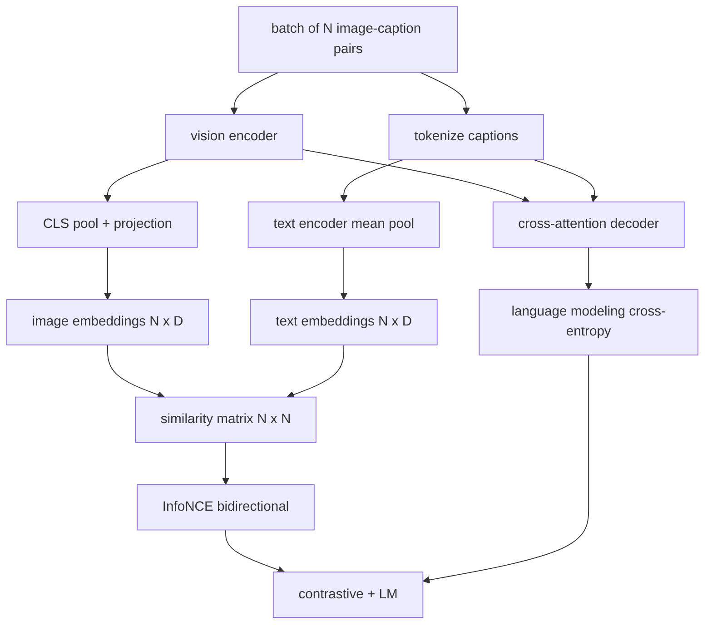

# 视觉语言预训练

> 编码器、投影层和解码器已经连接完毕。现在将它们一起训练。两个目标驱动学习：对比图文损失（InfoNCE），将匹配的配对拉近到联合嵌入空间中；语言建模损失，要求解码器为每张图像生成标题。两者结合，教会网络既能为标题找到正确的图像，也能为图像写出标题。

**类型：** 构建
**语言：** Python
**前置要求：** 第19阶段 课程30-37（Track B 基础）
**所需时间：** 约90分钟

## 学习目标

- 在一批图文配对上实现 InfoNCE 对比损失。
- 将对比损失与自回归语言建模损失组合。
- 合成一个 200 对的模拟图文语料库，无需下载真实数据集。
- 运行 50 步的演示训练循环，观察两个损失都在下降。

## 问题所在

视觉语言模型需要两种技能。它必须能排序：给定一个标题，在众多图像中找到正确的那张。它必须能生成：给定一张图像，写出标题。仅在一个技能上预训练模型，你只能得到半个系统。CLIP 擅长排序但不能生成标题。GPT-4V 能生成标题但使用单独的检索头进行排序。多目标预训练在一次训练中同时获得两种能力。

InfoNCE 处理排序的一半。对于一个 N 对的批次，模型将 N 个匹配的配对视为正样本，`N^2 - N` 个不匹配的配对视为负样本，然后在得到的 `(N, N)` 相似度矩阵上运行交叉熵损失。LM 损失处理生成的一半：标准的条件于图像的下一 token 预测。两个损失都是可微分的，可以共享编码器、投影器和解码器的权重。

## 概念说明



### InfoNCE 一段话概述

将 N 个图像嵌入堆叠为行，N 个文本嵌入堆叠为行。对两者进行 L2 归一化。计算 `N x N` 矩阵 `S = I T^T / tau`，其中 `tau` 是可学习的温度。对角线元素是匹配的配对；非对角线元素是负样本。以对角线上的 `argmax` 作为目标应用交叉熵：第 `i` 行的最高值应该在第 `i` 列。沿列方向对称地做同样的操作。总损失是两者的平均。这就是八行代码实现的 CLIP 损失。

### 温度很重要

温度 `tau` 控制 softmax 的峰值程度。太小（例如 `tau = 0.01`）时，梯度仅来自最难的负样本，训练噪声大。太大时 softmax 变平，梯度消失。CLIP 将 `tau` 作为参数学习；这里的演示也是如此。

### 语言建模损失

解码器通过交叉注意力消费图像记忆 token，并在每个位置预测下一个文本 token。损失是标准的与下一位置目标的交叉熵。填充位置在损失中被掩码掉。

### 组合损失

`total = contrastive + lm_weight * lm`，其中 `lm_weight` 是标量（通常为 1.0）。两个损失共享流向编码器和投影的梯度；只有解码器接收 LM 损失的梯度。这是 CoCa、BLIP 和 SigLIP 风格模型都使用的多任务配方，只是权重各有不同。

| 组件 | 损失面 | 影响范围 |
|------|--------|----------|
| InfoNCE | 联合空间中的配对排序 | 编码器 + 投影 + 文本头 |
| LM | 条件于图像的 token 预测 | 编码器 + 投影 + 解码器 |
| 组合 | 多任务 | 整个堆栈 |

### 为什么 50 步足以演示

模拟语料库是一个合成的 200 对集合，包含随机图像和随机标题 ID。在批次大小 16 的情况下经过 50 步 SGD，即使绝对值仍高于真实数据模型能达到的水平，两个损失也明显下降。演示的目标是确认梯度管道端到端正常工作，并且添加 LM 损失不会破坏对比目标的稳定性。

## 开始构建

`code/main.py` 实现了：

- `MultimodalModel`，组合一个小型 ViT 编码器、MLP 投影器、一个小型文本侧编码器（对嵌入 ID 进行平均池化），以及第 61 课的交叉注意力解码器。
- `info_nce_loss(image_emb, text_emb, temperature)`，双向 CLIP 风格的对比损失。
- `lm_loss(logits, target_ids, padding_id)`，带掩码的下一 token 交叉熵。
- `make_mock_corpus(seed, n_pairs)`，返回 200 个确定性的（图像，caption_ids）配对。
- 一个训练循环，运行 50 步，批次大小 16，Adam 优化器，以及可学习的 log-temperature 参数。每 5 步打印两个损失。

运行：

```bash
python3 code/main.py
```

输出：对比损失从约 `ln(16) = 2.77` 下降到 2.4 左右；LM 损失从随机均匀基线 `ln(512) ≈ 6.24` 下降到约 4.7。两个下降都证明梯度连接正确。真实模型训练数百万步；动态过程是相同的。

## 实际应用

这是以下模型使用的相同损失配方：

- **CLIP（2021）。** 仅图文对比，配有独立的冻结编码器标题探测器。
- **CoCa（2022）。** 图文对比加上图文标题 LM 损失，在一个模型中。正是本课构建的模式。
- **BLIP（2022）和 BLIP-2。** 对比加上 LM 加上图文匹配头。三个损失组合。
- **SigLIP（2023）。** 将 InfoNCE 替换为 sigmoid 配对损失；相同的对比角色，不同的函数形式。
- **LLaVA 系列。** 两阶段训练，第一阶段是对齐（冻结 LM 上的余弦），第二阶段添加带解冻 LM 的 LM 损失。第 60 课对应第一阶段；本课对应第二阶段。

## 测试

`code/test_main.py` 覆盖：

- InfoNCE 损失在图像/文本行之间是对称的
- 当相似度矩阵是完美的大正数对角线时，InfoNCE 损失返回 0
- LM 损失正确掩码填充位置
- 模型前向传播无错误地产生两个损失
- 5 步训练循环降低了组合损失

运行测试：

```bash
python3 -m unittest code/test_main.py
```

## 练习

1. 将 InfoNCE 替换为 SigLIP 风格的 sigmoid 配对损失，比较在模拟语料库上的收敛性。

2. 添加硬负样本挖掘步骤：每隔一个批次，从上一个批次中选择最难的非对角线配对并附加它。训练并观察对比损失是否下降更快。

3. 在联合嵌入之上添加一个图文匹配二值头（真/假：这些匹配吗？）作为第三个损失，复制 BLIP 的三头设置。

4. 将模拟语料库替换为从马尔可夫链中抽取的标题 ID 序列，其转移矩阵条件于图像哈希。标题损失应该进一步下降，因为存在可学习的真实信号。

5. 分别使用 `lm_weight = 0` 和 `lm_weight = 1` 训练同一模型。比较对比损失；LM 损失不应该损害排序目标。

## 关键术语

| 术语 | 含义 |
|------|------|
| InfoNCE | 噪声对比估计：在相似度矩阵上的交叉熵 |
| 温度 | 控制对比 softmax 峰值程度的标量 |
| 硬负样本 | 模型感到困惑的非对角线配对，对采样有用 |
| LM 损失 | 标题侧的标准下一 token 交叉熵 |
| 联合嵌入空间 | 图像和文本向量在投影后所在的共享空间 |

## 延伸阅读

- CLIP 论文，了解原始的对比配方。
- CoCa 论文，了解对比加标题在一个模型中的实现。
- SigLIP 论文，了解 sigmoid 配对损失变体及其更好的扩展性。
