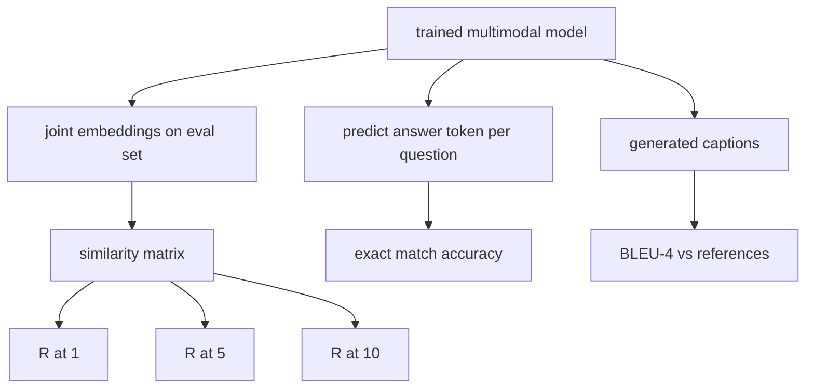

# 多模态评估

> 训练只是循环的一半。另一半是测量。本课从基础组件构建三个评估面：图文检索报告为 R@1、R@5、R@10；视觉问答报告为精确匹配准确率；图像标题报告为 BLEU-4。每个指标都是模型输出上的函数，以及一个可在秒级运行的合成评估套件。

**类型：** 构建
**语言：** Python
**前置要求：** 第19阶段 课程58-62（Track E 基础：编码器、Transformer、投影、交叉注意力融合、预训练）
**所需时间：** 约90分钟

## 学习目标

- 从图文嵌入之间的相似度矩阵计算 Recall@K。
- 从将（图像，问题）映射到固定答案词表的模型计算精确匹配 VQA 准确率。
- 从生成和参考 token 序列计算 BLEU-4，无需任何外部库。
- 在第 62 课训练模型之上构建的合成套件上运行所有三个评估。

## 问题所在

诱人的做法是在训练损失趋于平稳时就宣布多模态模型完成。训练损失衡量的是在训练分布上的拟合程度；它不衡量模型是否能在留出批次中排序配对、回答问题，或写出人类可接受的标题。三个评估面是标准的：

- **检索（R@1、R@5、R@10）。** 为查询标题构建联合嵌入；按余弦相似度对评估池中的每张图像排序；报告匹配的图像是否在前 1、前 5、前 10 中。对称的（图像到文本）形式以相同方式运行。
- **视觉问答（精确匹配）。** 给定（图像，问题），模型输出一个答案 token。精确匹配是每样本一比特：预测答案是否等于参考答案？在评估集上取平均。
- **标题生成（BLEU-4）。** 生成一个标题。计算 1-gram 到 4-gram 精度的几何平均值（相对于参考标题），带简洁惩罚。多参考是标准形式（一张图像，多个参考标题）。

每个指标都是一个薄函数。本课在代码中构建所有指标，使数学具体且可控。真实的基准套件（MS-COCO、VQA v2、GQA、OK-VQA）可以插入相同的函数形状。

## 概念说明



### 从相似度矩阵计算 Recall@K

构建图文嵌入之间的 `(N, N)` 余弦相似度矩阵。对每一行，按降序排列各列。Recall@K 是对角线索引位于前 K 位置的行的比例。对称的 Recall@K（标题到图像）在转置矩阵上计算。两个数字都会报告。对于 N=100 的评估，R@1 = 0.6 意味着 100 个标题中有 60 个将其正确的图像作为顶部匹配检索到。

### VQA 精确匹配

对于每个（图像，问题，答案），编码图像，嵌入问题，通过解码器融合，读出下一个 token。将预测的 token ID 与参考 ID 比较；相等则正确。在评估集上取平均。真实的 VQA 数据集为每个问题提供多个人工标注的答案，并使用软准确率公式（如果 10 个标注者中至少 3 个同意则为 1.0，否则按比例缩放）；本课使用单答案精确匹配以保持清晰。

### BLEU-4

```text
BLEU-4 = BP * exp(mean(log p1, log p2, log p3, log p4))
```

其中 `p_n` 是修改后的 n-gram 精度（出现在任何参考中的生成 n-gram 的截断计数，除以总生成 n-gram 数），`BP` 是简洁惩罚：

```text
BP = 1                if generated length > reference length
   = exp(1 - r/g)     otherwise, where r is reference length and g is generated
```

对于某些 `p_n` 为零的小样本需要平滑处理。实现使用 Chen 和 Cherry 的"方法 1"（对任何零计数的分子和分母加 1），这是低计数场景下最安全的默认方案。

### 合成评估套件

一个 50 样本的评估套件在内存中构建，使用与第 62 课相同的模拟语料库模式，但使用一个留出的种子。三个列表构成套件：

- `pairs`：50 个（图像，caption_ids）配对，用于检索。
- `vqa`：50 个（图像，question_ids，answer_id）三元组。
- `caps`：50 个（图像，[reference_caption_ids, ...]）条目，每张图像最多 3 个参考。

套件从种子确定性生成，并从训练语料库中留出，因此指标计算在模型从未见过的数据上。将套件持久化为 JSON 留作练习（见下文）。

| 指标 | 范围 | 随机基线（N=50） |
|------|------|------------------|
| R@1 | 0 到 1 | 0.02（1 / N） |
| R@5 | 0 到 1 | 0.10 |
| R@10 | 0 到 1 | 0.20 |
| VQA EM | 0 到 1 | 1 / 词表大小 |
| BLEU-4 | 0 到 1 | 小但非零 |

对于在合成数据上 50 步的训练运行，指标不期望很高；它们期望高于随机基线，这正是演示所检查的。

## 开始构建

`code/main.py` 实现了：

- `recall_at_k(sim_matrix, k)`，返回 `[0, 1]` 范围内的浮点数，支持两个方向。
- `vqa_exact_match(predictions, references)`，返回 `int` 相等性的均值。
- `bleu4(generated, references, smoothing=True)`，支持多参考。
- `build_eval_suite(seed, n_samples, vocab_size, max_len)`，返回三个确定性的评估列表。
- `evaluate(model, suite)`，运行所有三个指标并返回数字的 `dict`。
- 一个演示，加载第 62 课的新初始化多模态模型，评估它，然后训练 50 步并再次评估，打印前后的指标。

运行：

```bash
python3 code/main.py
```

输出：前后的指标表显示检索从接近随机改善到模型学习到的信号方向，VQA 改善到随机之上，BLEU-4 改善（合成结构足以提升 4-gram 精度）。

## 实际应用

每个指标直接映射到一个生产级基准：

- **检索。** MS-COCO 5K val、Flickr30K、ImageNet 零样本都是相同相似度矩阵上的 R@K 问题。将合成评估替换为真实文件，函数签名不变。
- **VQA。** VQA v2、GQA、OK-VQA 使用相同的精确匹配形状（VQA v2 使用软准确率而非单答案 EM）。
- **BLEU-4。** MS-COCO 标题生成、NoCaps、Flickr30K 标题生成都使用 BLEU-4 加 CIDEr 和 METEOR。添加 CIDEr 只需再加一个函数。

对于真实基准，将 `build_eval_suite` 替换为真实的加载器，保留函数体。数学与基准无关。

## 测试

`code/test_main.py` 覆盖：

- recall@k 在完美的单位相似度矩阵上返回 1.0，在翻转矩阵上对于 k < N 返回 0.0
- recall@k 遵守 `k <= N` 的上界
- bleu4 在生成与参考之一完全相等时返回 1.0
- bleu4 在不相交词表上返回 0.0
- vqa 精确匹配等于相等配对的比例
- build_eval_suite 返回预期数量的配对、vqa 项和标题条目

运行测试：

```bash
python3 -m unittest code/test_main.py
```

## 练习

1. 在标题指标中添加 CIDEr。CIDEr 使用 n-gram 的 TF-IDF 加权，奖励信息量大的 token。

2. 实现软准确率 VQA：每个问题多个人工答案，如果任何匹配则准确率为 `min(human_count / 3, 1)`。复制 VQA v2。

3. 添加 `bleu4` 的 NaN 安全变体，处理空生成序列而不崩溃。

4. 在 R@K 之外计算平均倒数排名（MRR）。MRR 对正确项在前 K 之外的位置敏感；R@K 对正确项是否在前 K 内敏感。

5. 在训练期间的五个检查点（步骤 0、10、20、30、40、50）上对模型运行评估，绘制学习曲线。确认指标轨迹与损失轨迹一致。

## 关键术语

| 术语 | 含义 |
|------|------|
| R@K | 正确匹配在前 K 结果中的查询比例 |
| 精确匹配 | 最简单的 VQA 评分：预测答案等于参考 |
| BLEU-4 | 1 到 4-gram 精度的几何平均值，带简洁惩罚 |
| 多参考 | 标题指标接受每个图像多个参考标题 |
| 留出 | 评估集从与训练语料库不相交的种子中采样 |

## 延伸阅读

- VQA v2 论文，了解软准确率公式和数据集统计。
- CIDEr 论文，了解 TF-IDF 加权 n-gram 标题生成。
- BLEU 原始论文（Papineni 等人，2002），了解平滑变体。
- MS-COCO 标题评估脚本，了解经典的参考实现。
