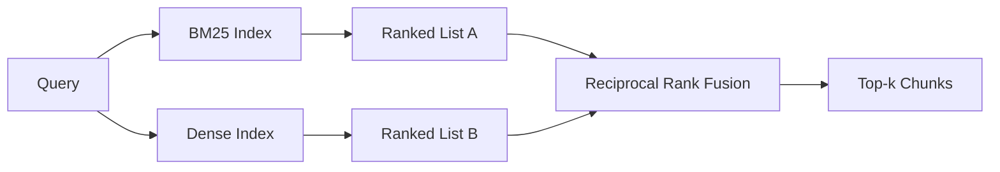

# BM25 与密集嵌入的混合检索

> 词法检索和语义检索在相反的查询分布上失败。使用倒数排名融合的混合检索不是插值，而是投票——投票在每个查询类别上都获胜。

**类型：** 构建
**语言：** Python
**前置要求：** 第11阶段 课程04（嵌入）、06（RAG）；第19阶段 Track B 基础（课程20-29）；第19阶段 课程64（分块策略）
**所需时间：** 约90分钟

## 学习目标

- 从零实现 BM25，基于 Robertson 和 Sparck Jones 的公式，包含字段加权、文档长度归一化和可调的 k1 与 b 参数。
- 在确定性模拟嵌入之上构建密集检索器，使循环可以离线运行。
- 精确实现 Cormack、Clarke 和 Buettcher 在 2009 年发表的倒数排名融合，并解释它为何优于分数加权插值。
- 调优 RRF k 常数和按模态的权重，在小型测试语料库上阅读权衡关系。

## 问题所在

词法搜索在查询包含语料库中逐字出现的字面标识符时获胜。一个 `AbortMultipartOnFail` 的查询通过 BM25 在微秒内返回正确的 Go 函数。同一个查询经过嵌入后，位于三个相似度聚类的边界，密集检索器将错误的文件排在第一位。

密集搜索在查询经过改述、远离语料库的字面 token 时获胜。用户询问"我们如何处理取消的上传"从未输入 abort 或 multipart 这个词。BM25 返回关于"上传大文件"的文档分块，因为那个页面包含 uploads 这个词。密集检索找到摘要中提到取消的 abort 函数。

两者之间的选择不是静态的。查询分布是变量。生产级 RAG 系统从同一个端点处理两类查询，因此检索必须同时处理两者。这就是混合检索。合并步骤是必须正确的部分。

## 概念说明



### BM25 一段话概述

BM25 对查询-文档对的评分方式是，对查询中的每个词项求和一个逆文档频率因子乘以一个饱和词频因子（包含长度归一化修正）。两个旋钮。`k1` 控制词频饱和度；默认值 1.5 是发表的推荐值，没有基准测试不应该调整。`b` 控制文档长度的影响程度；默认值 0.75 表示较长的文档被惩罚，但不是线性的。

IDF 公式使用平滑的 Robertson 和 Sparck Jones 定义，即 `log((N - df + 0.5) / (df + 0.5) + 1)`。对数内的加一确保当一个词项出现在超过一半的语料库中时 IDF 仍为正。这在小型语料库中很重要，因为停用词在技术上是罕见的。

字段加权让你告诉 BM25，符号名上的匹配比正文中的匹配更重要。实现方式是在索引期间对词项计数乘以一个乘数，而非在评分时。这保持了数学一致性，避免了每个字段单独评分。

### 密集检索一段话概述

使用嵌入模型将每个分块嵌入为固定维度的向量。查询时，嵌入查询，按余弦相似度对每个分块排序，返回 top-k。模型是决定质量的变量。检索算法本身只有两行：点积和排序。

本课使用确定性的基于哈希的嵌入，使你可以在没有网络调用的情况下阅读融合数学。哈希将 token 键控的偏移量求和到一个 96 维向量并归一化。余弦排序在多次运行间是确定性的，这是测试套件所要求的。

### 倒数排名融合，发表的公式

两个排序列表。对于出现在任一列表中的候选项，将其倒数排名贡献求和。2009 年的论文使用 `1 / (k + rank)`，默认 k 等于 60。按总分排序。这就是整个算法。

发表的常数 k = 60 不是任意的。当 k = 60 时，排名 1 的贡献是 1 / 61，排名 10 的贡献是 1 / 70。贡献衰减缓慢，因此深层候选项仍然有投票权。更小的 k 使顶部结果占主导。更大的 k 拉平贡献曲线。

我们实现中的两个可调旋钮。`k` 常数。一对按模态的权重，这样当你有先验证据表明某种模态在你的语料库上更好时，可以提升 BM25 或密集检索。将排名贡献乘以权重是最简单的有原则实现；它保留了排名衰减形状并保持无尺度。

### 为什么融合优于分数加权插值

BM25 分数是无界的且依赖语料库。余弦相似度有界于 -1 到 1。线性组合 `alpha * bm25 + (1 - alpha) * cosine` 需要按语料库调整 alpha，每次重新索引都会失效。基于排名的融合则不需要。两个排名在模态间是可比较的。发表的 RRF 基线在 2010 年以来的每个公开 TREC 评测中都优于分数插值。

这与你在 Vespa 和 Weaviate 文档中听到的关于 RankFusion vs RRF 的论点相同。他们得出了相同的结论：除非你有非常强的证据来插值分数，否则保持基于排名。

## 开始构建

`code/main.py` 实现了：

- `tokenize(text)` - 快速正则分词器。
- `BM25Index` - 字段加权，带有 `add` 和 `search`，可调 k1、b。
- `mock_embed`、`DenseIndex` - 与第 64 课相同的确定性嵌入，使分块可比较。
- `rrf(rankings, k, weights)` - 带有多模态权重的发表式融合。
- `HybridRetriever` - 组合 BM25 和密集检索。
- 一个演示 `main()`，加载小型测试语料库，运行三个针对每种检索器优缺点的查询，打印每种模态产生的排名以及融合列表。

运行：

```bash
python3 code/main.py
```

并排阅读演示输出。字面标识符查询在 BM25 排名 1、密集排名 4、RRF 排名 1。改述查询在 BM25 排名 6、密集排名 1、RRF 排名 1。模糊查询在 BM25 排名 3、密集排名 3、RRF 排名 1。融合不是平局决胜器；它是在每个查询类别上都获胜的系统。

## 调优旋钮

| 旋钮 | 默认值 | 调高的场景 | 调低的场景 |
|------|--------|-----------|-----------|
| BM25 k1 | 1.5 | 词项在文档中重复，你希望频率影响更大 | 文档很短，词项重复是噪声 |
| BM25 b | 0.75 | 长文档确实每个词表达更少 | 文档长度与主题无关 |
| RRF k | 60 | 深层候选项应该继续投票 | 排名 1 应该占主导 |
| BM25 weight | 1.0 | 你的语料库包含字面标识符且查询匹配它们 | 你的查询是用户改述的 |
| Dense weight | 1.0 | 查询是改述的 | 查询是字面的 |

通过在留出查询集上重新运行第 68 课的评估工具来调优，而不是凭直觉。

## 演示会隐藏的失败模式

**词表外 token。** BM25 的 IDF 是从语料库计算的，因此仅出现在查询中的词项贡献为零。密集嵌入为同一个词项产生幻觉向量。在语料库外的标识符上，密集模态返回看起来合理但错误的邻居。融合吸收了这一点，因为 BM25 返回空结果，排名贡献消失，但前提是你要按文档去重，而非按分块。

**停用词主导。** BM25 对"the"这个词的查询会在语料库上产生均匀排名。在索引器中过滤停用词，或者接受高 IDF 词项自然占主导。

**模态间相同内容。** 如果你的语料库小到 BM25 的 top-1 也是密集检索的 top-1，RRF 给你相同的 top-1 和相同的邻居。这是正确行为，不是失败，但会让融合看起来不起作用。在你的评估中添加对抗性查询对来验证融合确实在工作。

## 实际应用

生产模式：

- 在进程内索引 BM25；瓶颈是词频字典，而非向量。
- 在单独的存储中索引密集向量（本课使用平面列表；生产中你会使用 HNSW）。
- 并行运行两个查询；融合是在并集上的常数时间合并。
- 持久化每个检索命中的模态，以便下游重排器可以看到哪个模态为它投票。

## 交付

第 66 课取本课的融合 top-k 并使用交叉编码器重排。第 68 课用精确率、召回率、MRR 和 nDCG 评估整个管道。本课的混合检索器是第 69 课端到端系统的第一阶段。

## 练习

1. 将 `mock_embed` 替换为你的提供商的真实模型。重新运行演示，报告仅密集排名在改述查询上的变化。
2. 添加第三种模态：单独索引的分块摘要，作为第三个排序列表进行融合。测量增益。
3. 在 10、30、60、100、200 上扫描 RRF k。绘制第 68 课的 recall@k 曲线。报告曲线上在你的语料库上达到峰值的 k 值。
4. 正确实现 BM25F（按字段长度归一化而非乘数技巧），在符号匹配最重要的语料库上进行比较。

## 关键术语

| 术语 | 人们怎么说 | 实际含义 |
|------|-----------|----------|
| BM25 | "词法搜索" | 使用 idf x 饱和 tf x 长度归一化的概率排序 |
| RRF | "排名融合" | 跨排序列表的 1 / (k + rank) 之和；默认 k = 60 |
| k1 | "TF 饱和度" | 控制重复词项停止增加更多分数的速度 |
| b | "长度惩罚" | 0 表示忽略文档长度，1 表示完全归一化 |
| 字段加权 | "符号提升" | 在索引期间重复 token 以提升该字段的匹配 |
| 基于排名 vs 基于分数的融合 | "为什么 RRF 优于线性" | 排名在模态间可比较；分数不可比较 |

## 延伸阅读

- Cormack, Clarke, Buettcher, "Reciprocal Rank Fusion outperforms Condorcet and individual rank learning methods", SIGIR 2009
- Robertson, Walker, Beaulieu, Gatford, Payne, "Okapi at TREC-3"（原始 BM25 论文）
- [Vespa: Hybrid Retrieval with BM25 and Embeddings](https://docs.vespa.ai/en/tutorials/hybrid-search.html)
- [Weaviate: Hybrid Search](https://weaviate.io/developers/weaviate/search/hybrid)
- 第11阶段 课程06 - RAG 基础
- 第19阶段 课程64 - 输出在此被索引的分块器
- 第19阶段 课程66 - 消费融合 top-k 的交叉编码器重排器
