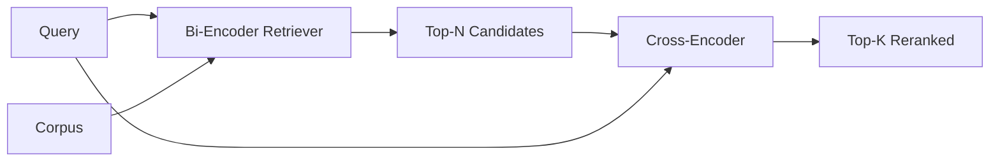

# 交叉编码器重排器

> 双编码器独立嵌入查询和文档。交叉编码器将它们拼接在一起并同时读取两者。交叉编码器是最聪明的阅读器，也是最慢的。作为双编码器 top-k 之上的第二阶段使用，它是物有所值的。

**类型：** 构建
**语言：** Python
**前置要求：** 第11阶段 课程06（RAG）、课程07（高级 RAG）；第19阶段 Track B 基础（课程20-29）；第19阶段 课程65（为本阶段提供输入的混合检索）
**所需时间：** 约90分钟

## 学习目标

- 通过输入形状、参数量和每查询成本区分双编码器检索器和交叉编码器重排器。
- 从零实现一个小型交叉编码器，作为一个 Transformer 块，消费打包的（查询，文档）序列并输出单个相关性标量。
- 组装两阶段的检索-重排管道：用廉价检索器检索 top-N，用交叉编码器将 N 重排为 top-K，返回 K。
- 在小型测试语料库上测量延迟与质量的权衡，为给定的延迟预算选择正确的 N。

## 问题所在

双编码器将查询和文档映射到同一个向量空间，按余弦排序。两个编码永远看不到对方。模型必须将文档的所有有用信息压缩到一个向量中，对查询视而不见。这很快——索引时每个文档一次嵌入，查询时每个查询一次——这是在语料库规模上排序的唯一方式。

代价是精度。两个具有相同整体主题的文档可能有几乎相同的嵌入，即使其中一个回答了查询而另一个没有。双编码器无法区分它们。

交叉编码器通过同时读取查询和文档来解决这个问题。模型接收 `[query] [SEP] [document]` 作为单个序列，在连接处运行全注意力，产生一个相关性标量。文档的每个 token 可以关注查询的每个 token。模型在完整上下文中决定分数。

代价是吞吐量。双编码器嵌入一次然后永远查询，交叉编码器对每个（查询，文档）对运行一次。对于一个千万文档的语料库，每个查询需要一千万次前向传播。在请求预算内不可行。

解决方案是分阶段。使用双编码器检索 top-N。使用交叉编码器将 N 重排为 top-K。N 较小（50 到 200），交叉编码器的质量提升集中在重要的地方。总延迟保持在请求预算内。总质量是交叉编码器的质量，受限于双编码器在 N 处的召回率。

## 概念说明



### 交叉编码器的输入形状

标准打包格式是 `[CLS] query_tokens [SEP] document_tokens [SEP]`。CLS 位置的输出被送入一个单一的线性头，输出相关性标量。一些实现使用平均池化代替 CLS；差异很小。关键是模型为每个配对产生一个数字。

一个 22M 参数的交叉编码器（发表的 `ms-marco-MiniLM-L-6-v2` 权重级别）是典型的生产节点。更小的模型质量下降快于延迟节省。更大的模型（例如 568M 参数的 `bge-reranker-v2-m3`）保留用于离线重排或 K 较小的首页重排。

### 为什么本课训练一个微小版本

真实的交叉编码器是微调过的编码器 Transformer。生产中你加载检查点并运行。本课的目标是展示模型的形状和延迟-质量曲线的形状，而非训练最先进的排序器。因此我们构建一个小型 `nn.Module`，包含一个 Transformer 块、多头注意力（默认 4 个头）和一个回归头。它从种子确定性初始化，因此演示无需磁盘上的权重即可重现。

玩具模型从测试语料库中学习正确的形状：相关的查询-文档对比不相关的配对有更高的预测分数。端到端管道重排双编码器的输出，重排后的 top-k 与金标准标签相关。

### 延迟 vs 质量

两阶段管道有一个可调参数：N。在留出查询集上从 5 到 100 扫描 N，你就得到曲线。

| N | 第二阶段的 Recall@1 | 每查询交叉编码器前向传播次数 | 延迟 |
|---|---------------------|---------------------------|------|
| 5 | 0.62 | 5 | 低 |
| 20 | 0.81 | 20 | 中 |
| 50 | 0.86 | 50 | 高 |
| 100 | 0.86 | 100 | 非常高 |

以上数字是形状的说明，而非本测试数据的测量结果。形状是真实的。在 20 到 50 个候选项附近总有一个拐点，重排提升趋于饱和。超过拐点你在白白付出。

从评估曲线加上延迟预算中选择 N。交叉编码器无法将召回率提升到双编码器在 N 处的召回率之上，因此低 N 限制的不仅是延迟，还有质量。

## 开始构建

`code/main.py` 实现了：

- `CrossEncoder` - 一个小型 `torch.nn.Module`：token 嵌入、一个带有多头注意力和前馈的 Transformer 块、产生单个标量的平均池化头。
- `tokenize_pair(query, document)` - 将两个字符串打包到单个 ID 序列中，带类型 ID 标记边界，确定性且使用标准库。
- `train_tiny(pairs)` - 在手工标注的（查询，文档，相关性）三元组列表上进行一次监督训练，使模型在测试数据上产生合理的分数。
- `rerank(query, candidates, top_k)` - 生产接口。
- `pipeline(query, retriever, top_n, top_k)` - 两阶段流程。
- 一个演示 `main()`，从第 65 课的模式加载语料库，检索 top-N，重排为 top-K，并排打印两个列表，报告每个阶段的延迟。

运行：

```bash
python3 code/main.py
```

输出显示双编码器的 top-N、交叉编码器的 top-K 和计时摘要。交叉编码器每次调用耗时更长，但不运行在整个语料库上。两阶段总时间保持在请求预算内，同时选出双编码器排第二或第三的答案。

## 演示会隐藏的失败模式

**交叉编码器不对称。** `rerank(q, d)` 和 `rerank(d, q)` 是不同的分数。始终先输入查询。如果意外交换，召回率崩塌。

**N 太低无法暴露问题。** 如果你设置 N = K，交叉编码器无法重新排序；它只能重新加权。提升看起来为零。选择 N 至少为 K 的三倍。

**训练数据泄漏到评估中。** 如果手工标注的训练配对包含评估查询，重排看起来很神奇。严格分离训练和评估，即使在测试数据上也是如此。

**生产权重是稠密的。** 一个 22M 参数的交叉编码器在 float32 下是 88MB。在承诺 sub-100ms p95 之前规划好模型服务器的内存。

**批处理很重要。** 真实的交叉编码器在一次批处理中运行 N 个候选项。本课在 `_batch_encode` 中做到这一点，使用 `torch.tensor(...)` 构建批量的 ID 和类型 ID 张量，运行一次前向传播。跳过批处理，延迟会乘以 N。

## 实际应用

生产模式：

- 将双编码器、交叉编码器和 N 绑定在一起。更改其中任何一个都会使评估失效。
- 按（查询，document_id）哈希缓存重排器的输出。同一查询对稳定语料库的重排结果是相同的；缓存命中为你提供免费的延迟削减。
- 记录排名 1 的交叉编码器分数。top-1 分数低于语料库特定阈值的查询是域外命中；将其作为"我不确定"呈现给 LLM。

## 交付

第 68 课端到端评估这个两阶段管道。第 69 课将这个重排器连接在第 65 课的混合检索器之后和答案生成器之前。重排器是端到端系统的第二阶段。

## 练习

1. 从 5 到 50 扫描 N，绘制重排输出的 recall@1。在本测试数据上找到拐点。
2. 将交叉编码器训练十个 epoch 而非一个。测量每个 epoch 正负配对之间的分数间隔。
3. 将平均池化替换为 CLS token 头。在本测试数据上比较收敛性。
4. 添加第二个交叉编码器头，预测二值"答案是否在文档中"标签。在推理时使用两个头；一个用于排序，一个用于阈值判断。
5. 将确定性的模拟双编码器替换为第 65 课的双编码器，串联两个阶段。测量 top-K 相对于仅双编码器的变化。

## 关键术语

| 术语 | 人们怎么说 | 实际含义 |
|------|-----------|----------|
| 双编码器 | "向量检索器" | 独立编码查询和文档；余弦排序 |
| 交叉编码器 | "重排器" | 联合编码（查询，文档）；输出单个相关性标量 |
| 两阶段管道 | "检索和重排" | 廉价检索器返回 N，昂贵重排器保留 K |
| N（候选预算） | "重排池" | 交叉编码器每查询评分的候选项数量 |
| 平均池化头 | "最后隐藏层的均值" | 将编码器最后一层的输出平均为一个向量 |

## 延伸阅读

- Nogueira, Cho, "Passage Re-ranking with BERT", 2019 - 经典的交叉编码器排序论文
- Reimers, Gurevych, "Sentence-BERT: Sentence Embeddings using Siamese BERT-Networks", 2019 - 关于双编码器 vs 交叉编码器
- [SentenceTransformers Cross-Encoders documentation](https://www.sbert.net/examples/applications/cross-encoder/README.html)
- [BGE Reranker v2 model card](https://huggingface.co/BAAI/bge-reranker-v2-m3)
- 第19阶段 课程65 - 为本重排阶段提供输入的混合检索器
- 第19阶段 课程68 - 测量本重排提升的评估
