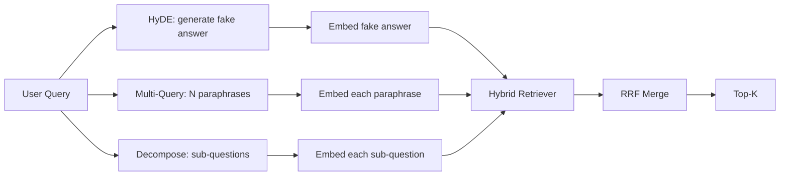

# 查询改写：HyDE、多查询和分解

> 用户输入的查询不是你的检索器想要的查询。改写在检索之前弥合差距，使索引看到更接近答案样子的内容。

**类型：** 构建
**语言：** Python
**前置要求：** 第11阶段 课程04（嵌入）、06（RAG）；第19阶段 Track B 基础（课程20-29）；第19阶段 课程64 和 65
**所需时间：** 约90分钟

## 学习目标

- 实现假设文档嵌入（HyDE）：生成一个假答案，嵌入它，用该向量而非查询向量进行检索。
- 实现多查询扩展：将一个查询改写为 N 个变体，分别检索，通过倒数排名融合合并并集。
- 实现查询分解：将复杂问题拆分为子问题，按子问题检索，合并。
- 在测试数据上将三种改写器进行对比，解释每种策略何时获胜。
- 组装一个产生确定性、测试数据输出的模拟 LLM，使改写器循环可以离线运行。

## 问题所在

用户输入"我们团队在上传失败且预算用完时做什么？"。语料库包含一篇文档说"AbortMultipartOnFail 在上传失败时中止一个进行中的 S3 多部分上传并递减每个桶的重试预算"。查询和文档不共享任何名词短语。BM25 错过了。双编码器将该文档排在第三或第四位，因为查询向量落在嵌入空间中更偏好关于取消任务的文档的区域，而非关于中止上传的文档。第 66 课的两阶段重排如果该文档在 top-N 中可以挽救答案，但如果它甚至没有进入 top-N，重排器永远看不到它。

修复方法是在查询接触检索器之前改写它。2023 年的论文"Precise Zero-Shot Dense Retrieval without Relevance Labels"（Gao 等人）引入了 HyDE：让 LLM 写出回答查询的文档，嵌入该假设文档，并使用其嵌入作为检索向量。假设文档位于嵌入空间的正确区域，因为它是用语料库的风格编写的。查询向量则不是。

两种相关技术与 HyDE 配合。多查询扩展（微软 GraphRAG 使用的术语）生成查询的 N 个改述，分别检索，然后合并。分解（在 2024 年 Stanford DSPy 工作中作为"子查询分解"推广）将"我们团队在上传失败且预算用完时做什么"拆分为两个问题："上传失败时发生什么"和"重试预算用完时发生什么"。两次检索，一次合并结果，答案的两个部分都可被检索到。

本课实现所有三种，并在同一测试语料库上运行它们。

## 概念说明



### HyDE 详解

HyDE 用 LLM 编写的假设文档向量替换用户的查询向量。提示词很短：

```
You are a domain expert. Write a one-paragraph passage that answers the question
below. Use the same vocabulary and phrasing the documentation in this domain would
use. Do not refuse. Do not say you do not know.

Question: {user_query}

Passage:
```

LLM 的答案作为事实性答案是错误的，因为 LLM 不了解你的语料库。这没关系。检索器不关心事实正确性，只关心 token 分布。假设段落包含"abort"、"multipart"、"bucket"、"budget"这些词，因为关于这个主题的文档段落就会这么说。嵌入该段落。向量落在真实段落附近。

在生产中，你将假设文档限制在两到三句。更长的假设收集更多噪声。更短的假设丢失 HyDE 需要的词法信号。

### 多查询详解

生成用户查询的 N 个改述。最简单的提示词：

```
Rewrite the following question in {N} different ways. Each rewrite must preserve
the original intent. Number them 1 to {N}. Do not add explanations.
```

对每个改述检索 top-k。用 RRF（第 65 课的相同算法）合并 N 个排序列表。廉价、并行、确定性。

多查询在用户的措辞只是众多同等有效的提问方式之一，且任何改述都问得更好时获胜。当所有改述同样糟糕时失败，因为原始查询以同样的方式很糟糕。

### 分解详解

单次检索无法满足多方面的问题。分解要求 LLM 将问题拆分为子问题，系统按子问题检索。提示词：

```
The following question may require information from multiple distinct topics.
Decompose it into a list of sub-questions. Each sub-question must be answerable
independently. If the question is already atomic, return it unchanged.

Question: {user_query}
```

按子问题检索。合并。分解是包含连接词、多子句比较或两个无关主题的问题的正确工具。对于原子问题是错误工具；分解器的工作是返回单个问题，而非编造假子问题。

### 为什么三种都存在

三者互补。HyDE 弥合查询-语料库的 token 差距。多查询覆盖改述方差。分解覆盖多主题查询。生产系统运行所有三种，并按查询选择策略（第 69 课的端到端系统展示了选择器）。

## 模拟 LLM

本课离线运行。模拟 LLM 是一个小型查找表，以用户查询为键，加上对未见过查询的回退。查找表包含：

- 对于每个测试查询：一个编写的假设段落、三个改述和一个分解。
- 对于未知查询：一个确定性转换：提取查询的内容词，通过同义词映射扩展，返回结果。

模拟的形状才是重要的，而非数据。生产中你将模拟替换为真实模型调用。检索器不变。

## 开始构建

`code/main.py` 实现了：

- `MockLLM` - 上述的确定性替身。
- `HyDERewriter` - 调用 LLM 编写假设文档，返回包含假设文本和检索器应使用的查询的 `RewriteResult`。
- `MultiQueryRewriter` - 调用 LLM 获取 N 个改述，返回查询列表。
- `DecomposeRewriter` - 调用 LLM 进行分解，返回子问题。
- `retrieve_with_rewriter` - 接收改写器和检索器，运行改写，融合结果。
- 一个演示，在测试数据上运行三个改写器，打印哪个策略首先返回了金标准答案文档。

检索器形状复用第 65 课（混合 BM25 + 密集）。融合是相同的 RRF。唯一的新形状是改写器接口，它很小。

运行：

```bash
python3 code/main.py
```

输出是按策略的排名和最终摘要。HyDE 在措辞不匹配的查询上获胜。多查询在改述方差查询上获胜。分解在多主题查询上获胜。回退（无改写器）在至少一个查询上失败。

## 演示会隐藏的失败模式

**HyDE 错误地幻觉出语料库特定的标识符。** 模型编造了一个函数名。假设文档在正确文档上的 BM25 分数崩塌，因为编造的名字现在是一个高权重 token，但不出现在索引中。限制假设的长度并在融合中降低 BM25 的权重。

**多查询改写全部收敛。** 弱模型产生三个几乎相同的改述。N 次检索返回相同的 top-k。RRF 合并不比单次检索好。在改写提示中添加显式的多样性指令，并通过 Jaccard 检测重复。

**分解过度拆分。** 分解器将原子问题变成列表。检索都返回同一文档但排名降低。合并比原始结果更糟。在扇出之前通过"这些子问题是否足够不同"检查来检测。

**延迟成倍增加。** HyDE 花费一次 LLM 调用。多查询花费一次 LLM 调用生成 N 个改述，然后 N 次检索。分解花费一次 LLM 调用进行分解，然后 M 次检索。检索并行运行；LLM 调用是底线。

## 实际应用

生产模式：

- 按查询长度进行策略选择：原子短查询使用多查询，复杂多子句查询使用分解，术语密集查询使用 HyDE。
- 按查询哈希缓存改写器输出。许多查询是重复的。
- 并行运行所有三种，用 RRF 将三个结果集融合为一个。成本是三次 LLM 调用和一次融合；质量是三种策略覆盖的并集。

## 交付

第 69 课将这个改写器阶段连接在第 65 课的检索器和第 66 课的重排器之前。第 68 课评估改写器对检索召回率的提升。

## 练习

1. 实现 RAG-Fusion（2024 年多查询的变体），改写器的改述有意多样化，然后重排步骤（第 66 课）选出最终列表。
2. 添加第四种策略：退步提示（要求 LLM 给出更一般的问题，在其上检索，然后缩小范围）。在测试数据上比较。
3. 训练分解器识别原子问题，添加"问题是否是原子的"头部。测量前后的过度拆分率。
4. 将模拟 LLM 替换为真实模型调用。测量你的技术栈上每种策略的延迟。
5. 为每次改写添加置信度分数。丢弃低于阈值的改写。测量对召回率的影响。

## 关键术语

| 术语 | 人们怎么说 | 实际含义 |
|------|-----------|----------|
| HyDE | "假文档检索" | LLM 编写答案；嵌入并用它而非查询进行检索 |
| 多查询 | "改述扩展" | 查询的 N 个改写；检索 N 次，用 RRF 合并 |
| 分解 | "子查询拆分" | 多主题查询拆分为子问题，分别检索 |
| 原子查询 | "单主题" | 无法分解而不编造假子问题 |
| 退步 | "抽象化查询" | 提出更一般的问题，检索，然后缩小范围 |

## 延伸阅读

- Gao, Ma, Lin, Callan, "Precise Zero-Shot Dense Retrieval without Relevance Labels"（HyDE），2023
- Microsoft Research, "Multi-Query Expansion for Retrieval"
- Stanford DSPy, "Subquery Decomposition for Multi-Hop QA"
- [LlamaIndex query transformations documentation](https://docs.llamaindex.ai/en/stable/optimizing/advanced_retrieval/query_transformations/)
- 第11阶段 课程07 - 高级 RAG 模式
- 第19阶段 课程65 - 本改写器为其提供输入的检索器
- 第19阶段 课程68 - 测量改写器提升的评估
