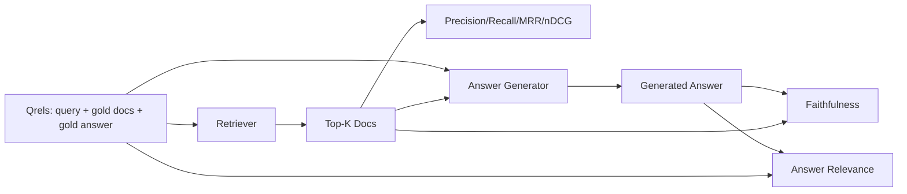

# RAG 评估：精确率、召回率、MRR、nDCG、忠实度、答案相关性

> 如果你不能同时评估检索和答案，你就无法发布系统。两者不是同一个指标，同一个提示在不同维度上会失败。

**类型：** 构建
**语言：** Python
**前置要求：** 第11阶段 课程06（RAG）、10（评估）；第19阶段 Track B 基础（课程20-29）；第19阶段 课程64、65、66、67
**所需时间：** 约90分钟

## 学习目标

- 从金标准 qrels 计算四个检索指标：precision@k、recall@k、MRR（平均倒数排名）和 nDCG@k。
- 计算两个答案级指标：忠实度（每个声明都有检索上下文支撑）和答案相关性（答案回应了问题）。
- 构建一个测试 qrels 文件（查询、金标准文档 ID、金标准答案文本），评估端到端读取它。
- 阅读指标值以诊断管道在哪里失败：检索、排序、生成或支撑。

## 问题所在

一个 RAG 系统至少有四个活动部件：分块器、检索器、重排器、生成器。任何一个都可能是错误答案的原因。没有按阶段的指标，你就是在盲飞。

用户报告了一个错误答案。是因为分块器切分了答案区间吗？是因为检索器没有将该分块包含在 top-k 中吗？是因为重排器将正确分块推到了位置一之后吗？是因为生成器忽略了分块而编造了内容吗？仅从答案你无法判断。你需要：

- 检索指标来评估检索器输出了什么。
- 排序指标来评估正确分块在顺序中的位置。
- 忠实度来评估生成器是否停留在检索到的上下文中。
- 答案相关性来评估答案是否回应了问题。

本课在测试 qrels 文件之上构建所有六个指标。评估是离线和确定性的；生产中你将模拟的 LLM-as-judge 替换为真实的。

## 概念说明



### Precision@k

在检索器返回的前 k 个文档中，有多少比例在金标准集中？如果金标准有三个文档，top-3 返回了其中两个和一个错误的，precision@3 是 2 / 3。当不相关检索分块的成本高时使用精确率（生成器在其上浪费 token，或者分块毒害答案）。

### Recall@k

在金标准文档中，有多少比例在 top-k 中？如果金标准有三个文档，top-5 包含了所有三个，recall@5 是 1.0。当遗漏答案的成本高时使用召回率（你宁愿看到一个额外的错误分块，也不愿完全遗漏答案分块）。

在生产 RAG 中，人们通常引用的指标是 recall@k。生成器可以轻松丢弃不相关的分块；它无法从从未见过的分块中编造答案。

### MRR（平均倒数排名）

对于每个查询，找到排序列表中第一个相关文档的位置。倒数排名是 1 / 位置。在查询集上取平均。MRR 是检索器将最佳答案放在顶部的能力的单数字摘要。

MRR 对位置 1 的权重很大。金文档在排名 1 的查询贡献 1.0。排名 2 贡献 0.5。排名 10 贡献 0.1。指标由列表顶部主导。

### nDCG@k

归一化折损累积增益。完整公式为每个检索到的文档分配增益（通常相关为 1，不相关为 0），按位置的对数折损求和，除以理想 DCG（完美排序时的 DCG）。范围 0 到 1。

nDCG 容纳分级相关性：金标准可以说"文档 A 是 3，文档 B 是 2，文档 C 是 1"。MRR 和 recall@k 将一切都展平为二值。当语料库中每个查询有多个部分相关文档时使用 nDCG。

### 忠实度

对于生成答案中的每个声明，检查该声明是否有检索上下文的支持。标准实现使用 LLM-as-judge 提示，接收（声明，上下文）并返回是或否。指标是通过的声明比例。

忠实度捕获生成器编造内容的失败模式。即使检索器返回了正确的分块，一个产生幻觉的生成器也是有问题的。忠实度也被称为支撑度、支撑、归因。

本课用确定性的模拟评判器实现忠实度，检查每个声明的 token 是否与检索上下文重叠超过阈值。生产中你替换为真实模型调用。指标的形状相同。

### 答案相关性

答案是否真正回应了问题？忠实度问"答案是否有上下文支撑？"。答案相关性问"答案是否有问题支撑？"。一个忠实但离题的答案在忠实度上得分高，在相关性上得分低。一个简短的、切题的、忽略上下文的答案在相关性上得分高，在忠实度上得分低。

标准实现也使用 LLM-as-judge：接收（问题，答案）并询问答案是否回应了问题。本课实现了一个 token 重叠加评判器的替身。

## 测试 qrels

```python
{
  "qid": "q1",
  "query": "what is the abort threshold for multipart uploads",
  "gold_doc_ids": ["d1", "d3"],
  "gold_answer_substring": "three failed parts",
  "graded_relevance": {"d1": 3, "d3": 2},
}
```

每个查询携带：
- 查询字符串，
- 金标准文档 ID 集合（用于精确率 / 召回率 / MRR），
- 分级相关性字典（用于 nDCG），
- 金标准答案子串（作为每个 qrel 的参考元数据保留；本课的忠实度通过评判提取的声明与检索上下文的对比来计算，而非与此子串对比）。

在生产中你需要标注这些。本课提供一个手工构建的测试数据，使评估可以开箱即用。

## 开始构建

`code/main.py` 实现了：

- `precision_at_k(retrieved, gold, k)` - 字面定义。
- `recall_at_k(retrieved, gold, k)` - 字面定义。
- `mean_reciprocal_rank(retrieved_list_of_lists, gold_list)` - 查询集上的均值。
- `ndcg_at_k(retrieved, graded_relevance, k)` - DCG / IDCG，支持二值或分级增益。
- `extract_claims(answer)` - 将答案拆分为句子级声明。
- `faithfulness(claims, context_texts, judge)` - 被判断为有支撑的声明比例。
- `answer_relevance(question, answer, judge)` - 判断答案是否回应问题。
- `MockJudge` - 确定性的 token 重叠评判器，使评估可离线运行。
- `evaluate_pipeline(pipeline_fn, qrels, ks)` - 运行每个指标的编排器。
- 一个演示，对 qrels 运行三个管道变体（分块器基线、混合检索、混合 + 重排），打印指标表。

运行：

```bash
python3 code/main.py
```

输出在单一指标表中显示每个变体的 precision@k、recall@k、MRR、nDCG@k、忠实度和答案相关性。混合检索行在召回率上优于分块器基线；重排行在 MRR 上优于混合。

## 阅读指标以诊断故障

| 症状 | 可能原因 | 修复方向 |
|------|----------|----------|
| 低 recall@k，低 precision@k | 分块器切分了答案或检索器找不到它 | 分块器边界（课程64）或检索器模态（课程65） |
| 不错的 recall@k，低 MRR | 正确分块在 top-k 中但不在位置 1 | 重排器（课程66） |
| 高 MRR，低忠实度 | 尽管有正确上下文，生成器仍编造内容 | 生成提示词；强制引用或拒绝 |
| 高忠实度，低相关性 | 答案有支撑但离题 | 查询改写器（课程67）或生成提示词 |
| 四个都高，用户仍抱怨 | 评估集不具代表性 | 用真实用户查询扩展 qrels |

## 演示会隐藏的失败模式

**LLM-as-judge 偏差。** 模型判断自己的输出比实际更忠实。使用与生成器不同的模型系列作为评判器，或手工评估一个样本。

**Qrels 退化。** 金标准答案随语料库变化而漂移。一个在 2024 年 1 月是 q1 金标准的文档，在 2024 年 10 月不再是正确答案，因为团队重命名了函数。安排季度 qrels 审查。

**忠实度微观检查遗漏宏观声明。** 逐句忠实度可以通过，但整体答案的结构具有误导性。在自动指标之上添加样本级定性审查。

**Recall@k 掩盖了按查询的失败。** 90% 的平均召回率可以隐藏某一类查询总是遗漏。按查询类别（字面、改述、多主题）切分 qrels，按切片报告。

## 实际应用

生产模式：

- 在每次检索器或生成器更改时运行评估。将 recall@k 回归视为测试失败。
- 按查询持久化指标追踪。当用户投诉时，查找匹配的 qrels 条目，看它是否会被捕获。
- 分层 qrels：20 个查询的冒烟集在 CI 中运行；200 个的回归集每晚运行；2000 个的深度集每周运行。

## 交付

第 69 课组装整个管道（分块器、检索器、重排器、生成器），并对端到端系统运行此评估。

## 练习

1. 添加第五个检索指标：hit-rate@k。与 recall@k 比较。解释何时它们不同。
2. 实现分级忠实度：0（无支撑）、1（部分支撑）、2（完全支撑）。相应更新指标。
3. 将模拟评判器替换为真实模型调用。测量模拟和真实评判器在测试数据上的分歧。
4. 添加查询类别切片（"字面"、"改述"、"多主题"）。按切片报告指标。
5. 添加"答案长度"指标并与忠实度关联。绘制曲线。

## 关键术语

| 术语 | 人们怎么说 | 实际含义 |
|------|-----------|----------|
| Precision@k | "检索命中率" | 前 k 个中属于金标准的比例 |
| Recall@k | "金标准命中率" | 金标准在前 k 中的比例 |
| MRR | "首次命中位置" | 第一个相关文档的 1 / rank 的均值 |
| nDCG@k | "分级排序质量" | top-k 的 DCG 除以理想 DCG |
| 忠实度 | "支撑度" | 答案声明被检索上下文支撑的比例 |
| 答案相关性 | "是否回应了问题？" | 答案是否匹配问题的意图 |
| Qrels | "金标准标签" | 标注的查询及其金标准文档和答案的集合 |

## 延伸阅读

- Buckley, Voorhees, "Evaluating Evaluation Measure Stability", SIGIR 2000 - 排序指标的经典论文
- Jarvelin, Kekalainen, "Cumulated Gain-based Evaluation of IR Techniques" - nDCG 论文
- [Ragas: Automated Evaluation of RAG Pipelines](https://docs.ragas.io)
- [Anthropic, Evaluating RAG](https://www.anthropic.com/news/evaluating-rag)
- 第11阶段 课程10 - 评估框架基础
- 第19阶段 课程64-67 - 在此评估的组件
- 第19阶段 课程69 - 本评估评分的端到端管道
