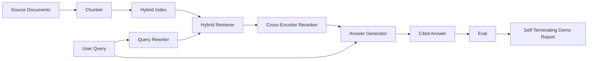

# 端到端 RAG 系统

> 六节课的组件。一个管道。一个评估循环。一个自行终止的演示。这就是你交付的系统。

**类型：** 构建
**语言：** Python
**前置要求：** 第11阶段 课程06（RAG）、10（评估）；第19阶段 Track B 基础（课程20-29）；第19阶段 课程64、65、66、67、68
**所需时间：** 约90分钟

## 学习目标

- 将分块器、混合检索器、查询改写器、交叉编码器重排器和答案生成器组合为一个端到端管道。
- 实现一个通过分块锚点引用其声明的答案生成器，带有低置信度拒绝回退。
- 对组装的管道运行第 68 课的评估，证明分阶段构建在每个指标上都优于单独运行的相同组件。
- 构建一个自行终止的 CLI 演示，摄入测试语料库，运行固定查询集，以摘要报告退出码为零。

## 问题所在

六个独立的组件什么都证明不了。分块器可以在语料库上的 recall@5 获胜，但在系统的 recall@5 上失败，因为检索器无法排序分块器输出的内容。重排器可以在合成候选池上提升 MRR，但在真实的双编码器候选上失败，因为双编码器在重排预算下的召回率太低。查询改写器可以在单个查询上提升金标准文档，但在下一个查询上失败，因为 LLM 模拟返回了退化的假设。

集成测试是在同一测试 qrels 上端到端运行的整个管道，使用相同的指标，一个组装一切的编排器文件。这就是本课构建的。如果集成管道上的指标优于每个阶段单独演示上的指标，你就证明了系统。

## 概念说明



### 组装选择

管道是一个小图。每个阶段是一个有清晰签名的函数。

| 阶段 | 输入 | 输出 |
|------|------|------|
| 分块器 | 文档文本 | Chunk 记录列表 |
| 检索器 | 查询字符串 | Top-N Chunk 记录 |
| 改写器（可选） | 查询字符串 | 改写列表 + 假设 |
| 重排器 | 查询、候选 | 带交叉分数的 Top-K Chunk 记录 |
| 生成器 | 查询、top-K Chunk 记录 | 带引用的答案字符串 |

当每个签名稳定时，组合是直接的。本课的 `Pipeline` 类持有五个阶段和一个按顺序运行它们的 `query` 方法。每个阶段都可替换：传入不同的分块器、检索器、改写器、重排器或生成器，管道仍然运行。

### 带引用的答案生成器

生成器是最后一个阶段，也是最容易出错的。本课提供一个确定性的模拟生成器：

1. 接收 top-K 重排后的分块。
2. 选择最多两个文本与查询具有最高内容 token 重叠的分块。
3. 输出一个由每个选中分块的一句话拼接而成的答案，每句话后跟一个 `[doc_id:chunk_index]` 锚点。
4. 如果没有分块的重叠超过拒绝阈值，输出"I do not know"且无引用。

在生产中你将模拟替换为带有以下提示模板的真实 LLM 调用：

```
You are answering a question using only the snippets below.
Cite every claim with the anchor in parentheses.
If the snippets do not answer the question, say "I do not know".

Question: {query}

Snippets:
{enumerated chunks with anchors}

Answer:
```

低置信度拒绝路径是交叉编码器排名 1 分数被记录的全部原因。如果它低于语料库阈值，生成器拒绝。这是防止幻觉答案的安全阀。

### 自行终止的演示

演示端到端运行一切。它打印一个查询的按阶段分解，对四个测试 qrels 运行评估，打印指标表，如果第 68 课的所有指标都满足演示中设定的阈值，则以状态零退出。如果任何指标低于阈值，演示以非零状态退出，并附带指出失败指标的消息。

这就是 CI 冒烟测试的形状。管道离线、快速、确定性运行。阈值在测试数据上有意设置得很严格，使六个课程中任何一个的回归都会导致演示失败。

## 开始构建

`code/main.py` 实现了：

- `Chunk` - 在所有阶段传递的记录（扩展第 64 课的形状，添加 chunk_index 和源 doc_id）。
- `Chunker` - 从第 64 课选择策略（默认递归分割）。
- `HybridIndex` - 打包第 65 课的 BM25 + 密集 + RRF。
- `Rewriter`（可选） - 根据查询长度和连接词的存在，从第 67 课的 HyDE、多查询、分解中选择一种。
- `Reranker` - 第 66 课训练的交叉编码器，使用更小的测试训练集使其在秒级收敛。
- `Generator` - 带引用和低置信度拒绝的确定性模拟生成器。
- `Pipeline` - 组合五个阶段，带有 `query(question)` 方法，返回 `Result(answer, top_k, latency_ms_per_stage)`。
- `run_demo()` - 摄入语料库，运行三个测试查询，运行评估，打印结果，根据阈值设置退出码。

运行：

```bash
python3 code/main.py
```

输出是一个打印的查询追踪、完整的评估表和最终的通过/失败状态。在测试数据上返回退出码 0。

## 演示会隐藏的失败模式

**分块器边界漂移。** 如果你在评估 qrels 标注和演示之间切换分块器策略，金标准文档 ID 不再对齐。在 qrels 文件中锁定分块器策略。演示包含一个命名分块器的头部。

**重排器训练集泄漏到评估中。** 第 66 课的 14 个训练三元组包含与评估查询相似的查询。在生产中，严格留出评估查询。演示的评估查询有意与重排训练集不相交。

**模拟生成器隐藏幻觉风险。** 模拟不会产生幻觉，因为它只输出检索分块中的文本。本课指出这一点，并将生产替换路径指向真实模型。

**无流式传输。** 管道在每个阶段结束时返回完整答案。生产系统会流式传输生成器的输出。流式传输超出范围；答案级指标在最终字符串上工作。

**延迟是离线的。** 模拟 LLM 调用是常数时间。真实 LLM 调用占主导。在请求范围内规划延迟预算；本课的按阶段计时只测量 CPU 工作。

## 实际应用

生产模式：

- 在一个编排器下发布管道文件，带有显式的阶段接口。避免将组装分散到整个仓库。
- 在每次触及阶段的合并之前运行评估。如果评估下降，合并不落地。
- 按 CI 运行持久化指标追踪，以便将回归归因到阶段替换。
- 添加 20 个查询的冒烟集（回归集的子集），在 30 秒内运行；完整的回归集每晚运行。

## 交付

本课的管道文件是第 19 阶段 Track F 其余课程假设的形状。后续课程将在此基础上添加摄入自动化、增量重索引、遥测和服务层。检索、重排、改写和评估的两半在这里完成。

## 练习

1. 在改写器内部添加按查询策略选择器：第 67 课的启发式规则（长度、连接词、术语比率）选择 HyDE、多查询或分解。
2. 在环境标志后为生成器添加真实 LLM 调用。默认使用模拟。测量延迟差异。
3. 扩展演示以接受 `--corpus path` 标志加载真实语料库。重新运行评估和阈值检查。
4. 为分块器添加 `--strategy` 标志。测量每种策略对端到端召回率的贡献。
5. 添加流式生成器接口并输入评估。确认忠实度是在最终字符串上计算，而非在流式前缀上。

## 关键术语

| 术语 | 人们怎么说 | 实际含义 |
|------|-----------|----------|
| 管道 | "RAG 管道" | 从摄入到带引用答案的组合阶段 |
| 引用锚点 | "源链接" | 附加到每个声明的（doc_id，chunk_index）参考 |
| 低置信度拒绝 | "我不知道" | 当重排器 top-1 分数低于阈值时，生成器不返回答案 |
| 冒烟集 | "CI 评估" | 每次 PR 检查中运行的最小子集 qrels |
| 阶段接口 | "函数签名" | 每个管道阶段的稳定输入和输出类型 |

## 延伸阅读

- [Anthropic, Building search and retrieval](https://www.anthropic.com/news/contextual-retrieval)
- [Pinterest, MCP internal search](https://medium.com/pinterest-engineering) - 参考生产架构
- [Ragas: Automated Evaluation of RAG Pipelines](https://docs.ragas.io)
- 第11阶段 课程06 - RAG 基础
- 第19阶段 课程64-68 - 在此组合的组件
