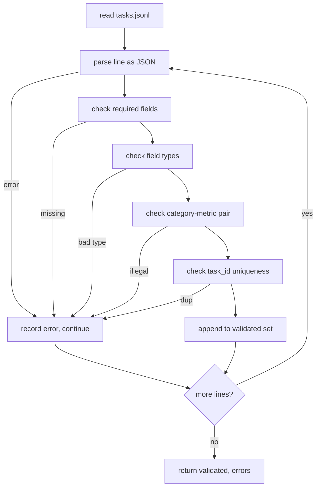

# 任务规范格式

> 评估工具的好坏取决于其任务所遵守的契约。在编写任何评分函数之前，先冻结 JSONL 形状和指标词表。

**类型：** 构建
**语言：** Python
**前置要求：** 第19阶段 Track B 基础
**所需时间：** 约90分钟

## 学习目标

- 定义一个 JSONL 任务记录模式，在一个形状中涵盖算术、多选、代码执行、分类和自由文本摘要。
- 固定指标名称的封闭词表，使后续课程（71-73）可以基于单个字段进行分发。
- 将少样本示例和后处理规则指定为任务的一部分，而非运行器的一部分，使相同的提示在不同模型间产生相同的目标。
- 实现一个严格的验证器，在格式错误的记录到达运行器之前拒绝它们。
- 提供一个 10 任务的测试集，覆盖规范的每个分支，使验证器有真实内容可验证。

## 为什么需要冻结规范

一个研究代码库积累评估脚本的速度比积累测试快。六个月后，每个笔记本都有自己的 JSON 形状，每个指标都被实现两次，没有任何东西可以跨运行比较。修复方法很无聊。选择一个模式。写一个验证器。拒绝其他一切。这就是本课所做的。

该形状借鉴了 BIG-bench、HELM 和 lm-eval 风格工具的想法，但字段名是我们自己的。每个字段有唯一的所有者。运行器读取任务。指标读取目标。后处理步骤规范化生成。没有字段在管道中间可变。

## 记录形状

任务是一个单行 JSON 对象。工具读取 `tasks.jsonl` 并独立验证每一行。一行出错会中止该记录，而非整个运行。

```json
{
  "task_id": "arith_001",
  "category": "arithmetic",
  "prompt": "Compute the result. Question: 17 + 24\nAnswer:",
  "targets": ["41"],
  "metric_name": "exact_match",
  "few_shot_examples": [
    {"prompt": "Question: 2 + 2\nAnswer:", "completion": "4"}
  ],
  "post_process": "strip_whitespace",
  "metadata": {"difficulty": "easy"}
}
```

必需字段是 `task_id`、`category`、`prompt`、`targets`、`metric_name`、`post_process`。`few_shot_examples` 和 `metadata` 是可选的。未知的顶级字段会导致验证失败。

## 字段规则

`task_id` 是没有空白字符的字符串。验证器强制在整个文件中唯一。

`category` 是 `arithmetic`、`mcq`、`code_exec`、`classification`、`summary` 之一。类别约束了哪些指标和后处理配对是合法的。`code_exec` 任务必须使用 `metric_name = code_exec`，`mcq` 任务必须使用 `metric_name = exact_match` 配合单字母目标。

`prompt` 是非空字符串。验证器禁止尾随空白，拒绝在提示正文中已经包含少样本块的记录。少样本渲染发生在运行器中，而非作者处。

`targets` 是非空字符串列表。对于 `exact_match`，任何匹配的元素都算数。对于 `f1` 和 `rouge_l`，最高分的目标获胜。对于 `mcq`，列表恰好包含一个元素。

`metric_name` 是 `exact_match`、`f1`、`bleu_4`、`rouge_l`、`accuracy`、`code_exec` 之一。词表是封闭的。新指标需要新课程和这里的新条目。

`few_shot_examples` 是 `{prompt, completion}` 对的列表。验证器将列表限制在八个条目以内，以保持提示有界。

`post_process` 是 `none`、`strip_whitespace`、`lower`、`extract_letter`、`extract_code_block`、`extract_first_line` 之一。每个规则有单一确定性行为。验证器禁止组合规则。

## 验证器行为



验证器返回两个列表：验证通过的记录和包含出错行、违规规则和出错字段的错误记录。如果错误列表非空，运行器拒绝启动，除非设置了显式的 `--allow-bad-tasks` 标志。

## 少样本渲染

运行器将少样本示例以空行分隔符拼接在提示前面。相同的代码路径对每个模型运行，因此唯一的方差来源是模型本身。作者只编写一次示例，而非每个提供商一次。

```python
def render(task):
    parts = []
    for ex in task.get("few_shot_examples", []):
        parts.append(ex["prompt"] + " " + ex["completion"])
    parts.append(task["prompt"])
    return "\n\n".join(parts)
```

## 后处理规则

后处理步骤在生成之后、指标之前运行。它是确定性和无状态的。

- `none` 返回不变的字符串。
- `strip_whitespace` 去除前导和尾随空白。
- `lower` 将字符串转为小写。
- `extract_letter` 返回第一个匹配 `[A-E]` 的字符，用于 MCQ。
- `extract_code_block` 返回第一个三反引号围栏块的主体，用于代码执行。
- `extract_first_line` 返回第一个非空行，用于摘要分类。

需要此列表之外规则的任务属于新课程。

## 本课不做什么

它不评分。它不调用模型。它不运行代码。这些在课程 71、72 和 75 中。本课冻结了它们都遵守的契约。

10 任务测试集涵盖两个算术项、两个 MCQ 项、两个代码执行项、两个分类项和两个摘要项。验证器对所有 10 项都通过。一个单独的测试数据（`tasks_bad.jsonl`）触发每条规则，验证器返回恰好相应数量的错误。

## 如何阅读代码

`main.py` 定义了 `TaskSpec`、`validate_task`、`validate_file` 和 CLI 入口点。测试数据加载器是 `load_fixtures`。渲染和后处理辅助函数与验证放在一起，使第 75 课的运行器可以导入单个模块。

从头到尾阅读 `main.py`。然后阅读 `code/tests/test_spec.py`。测试固定了每个验证规则和每个后处理行为。`main.py` 底部的演示验证打包的测试数据并打印摘要。

## 延伸阅读

真实的评估套件会像模式增长列一样增长类别。冷静的做法是拒绝在没有同时添加指标、后处理规则和至少一个测试任务的情况下添加类别。将规范视为数据库迁移。每个更改都被审查、版本化，并有测试伴随。本课的验证器就是门控。
