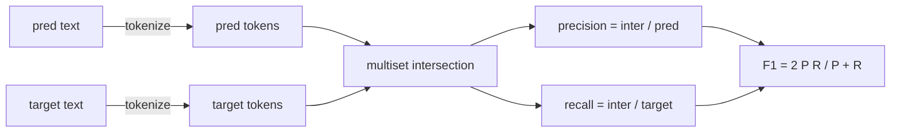
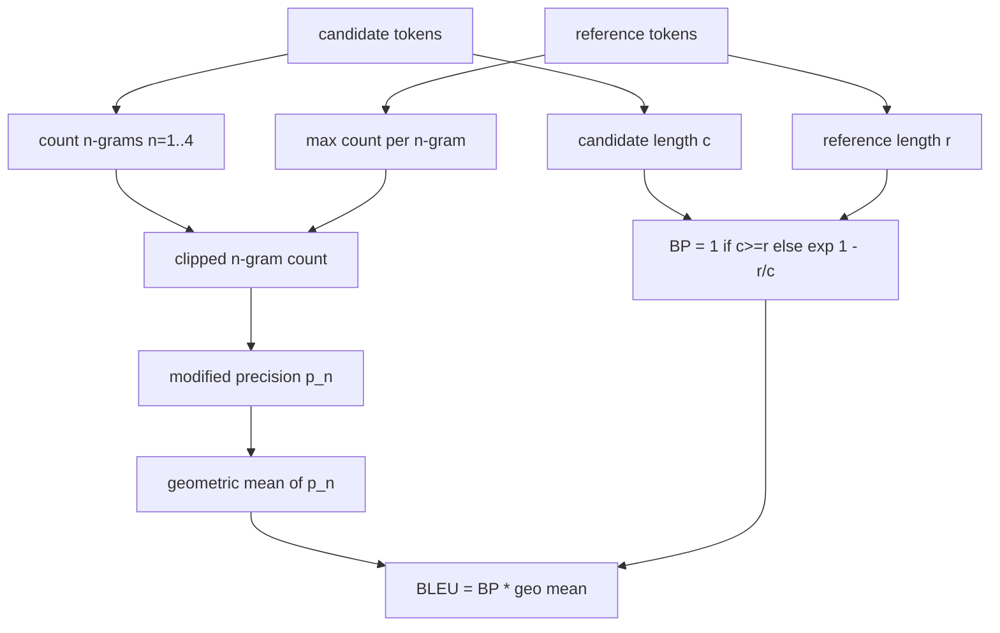

# 经典指标

> BLEU、ROUGE-L、F1、精确匹配、准确率。五个指标仍占已发表 LLM 评估数字的大多数。从第一性原理实现每一个，这样你才知道数字意味着什么。

**类型：** 构建
**语言：** Python
**前置要求：** 第19阶段 Track B 基础，课程70
**所需时间：** 约90分钟

## 学习目标

- 实现 token 级别的精确匹配、F1 和准确率，带有显式分词规则。
- 从头实现 BLEU-4：修改后的 n-gram 精度、n 等于 1 到 4 的几何平均值、简洁惩罚。
- 使用最长公共子序列实现 ROUGE-L，配合精确率和召回率的 F-beta 组合。
- 基于第 70 课的 `metric_name` 字段进行分发，使运行器保持指标无关。
- 使用从计算示例而非第三方库获得的参考向量固定行为。

## 为什么重新实现

你会读到报告 BLEU 28.3 的论文和报告 BLEU 0.283 的论文。你会发现两个库的 ROUGE-L 分数相差十分，因为一个转为小写而另一个没有。停止困惑的最快方式是自己编写指标，然后指出分词器在哪一行决定、平滑在哪一行应用。之后，跨论文比较数字就变成了阅读指标设置的事，而非争论库。

标准库加 numpy 就够了。BLEU 是计数和截断。ROUGE-L 是动态规划。F1 是 token 上的集合交集。最难的部分是选择分词器并坚持使用它。

## 分词

分词器是 `re.findall(r"\w+", text.lower())`。小写、字母数字连续序列、丢弃标点。本课的每个指标都使用这个确切的分词器。运行器不能选择。如果你更换分词器，你运行的就是不同的基准。

```python
TOKEN_RE = re.compile(r"\w+", re.UNICODE)
def tokenize(text):
    return TOKEN_RE.findall(text.lower())
```

这是有意的简化。生产环境会关心 CJK、缩写和代码标识符。本课的重点是分词器是一个契约，而非旋钮。

## 精确匹配

```python
def exact_match(pred, targets):
    return float(any(pred.strip() == t.strip() for t in targets))
```

每个任务返回 1.0 或 0.0。数据集上的聚合是均值。这是算术、MCQ 和短分类任务的主力指标。

## Token 级别 F1

为预测和目标设置 token 多重集。精确率是多重集交集除以预测的多重集。召回率是相同的交集除以目标的多重集。F1 是调和平均值。实现处理了空预测和空目标的边界情况。



对于多目标任务，我们在目标列表上取最佳 F1。这与文献中广泛报道的 SQuAD 风格行为一致。

## BLEU-4

BLEU 是经典的机器翻译指标，在摘要工作中仍然出现。我们使用的公式是语料库级别的 BLEU-4，带有标准简洁惩罚和修改后 n-gram 计数的加一平滑，以避免单个缺失的 4-gram 将分数推到零。

对于每个候选-参考对，我们计算 n 等于 1、2、3、4 的修改后 n-gram 精度。修改后的精度将候选 n-gram 计数按该 n-gram 在任何参考中的最大计数截断，因此候选不能通过重复一个短语来膨胀。四个精度的几何平均值被简洁惩罚包裹。



平滑规则是 Lin 和 Och 称为方法 1 的那个：在取对数之前，对每个 n-gram 精度的分子和分母都加一。这避免了当参考没有匹配的 4-gram 时的 `log 0`，并且在长候选上接近未平滑的值。

## ROUGE-L

ROUGE-L 比较候选和参考 token 序列的最长公共子序列。LCS 捕获词序而不强制连续性，这就是为什么它是默认的摘要指标。我们使用标准动态规划表计算 LCS 长度，然后推导召回率为 `lcs / reference length`，精确率为 `lcs / candidate length`，并用 beta 等于一的 F-beta 组合为对称的 F1 形式。

```python
def lcs_length(a, b):
    n, m = len(a), len(b)
    dp = numpy.zeros((n + 1, m + 1), dtype=int)
    for i in range(n):
        for j in range(m):
            if a[i] == b[j]:
                dp[i+1, j+1] = dp[i, j] + 1
            else:
                dp[i+1, j+1] = max(dp[i+1, j], dp[i, j+1])
    return int(dp[n, m])
```

numpy 表使实现可读；纯 Python 列表也可以工作。选择 ROUGE-L 的任务付出每任务 O(n m) 的成本。对于典型的摘要长度，这保持在一毫秒以内。

## 准确率

对于多目标任务分类，准确率简化为对单个规范化目标的精确匹配。我们将其暴露为单独的函数，使分发器可以基于 `metric_name` 分发，而无需在运行器内部进行字符串比较。

## 分发契约

单一入口点是 `score(metric_name, prediction, targets)`。它返回 `[0, 1]` 范围内的浮点数。运行器不在指标名称上分支。它传递调用并写入结果。这是第 75 课将粘合到第 70 课任务规范的接口。

```python
def score(metric_name, pred, targets):
    if metric_name == "exact_match":
        return exact_match(pred, targets)
    if metric_name == "f1":
        return max(f1_score(pred, t) for t in targets)
    if metric_name == "bleu_4":
        return max(bleu4(pred, t) for t in targets)
    if metric_name == "rouge_l":
        return max(rouge_l(pred, t) for t in targets)
    if metric_name == "accuracy":
        return accuracy(pred, targets)
    raise ValueError(f"unknown metric_name: {metric_name}")
```

`code_exec` 在第 72 课中处理并插入分发器。

## 本课不做什么

它不调用模型。它不规范化生成，除非第 70 课的后处理规则已经做了。它不计算置信区间。它不做 BLEURT 或 BERTScore（那些需要模型，属于不同的课程）。重点是基础：五个指标、一个分词器、一个分发表。

## 如何阅读代码

`main.py` 将每个指标定义为自由函数加上分发器。参考向量在文件底部的 `_reference_examples` 块中。演示对八个示例运行分发器并打印按指标的分数。`code/tests/test_metrics.py` 中的测试固定参考向量并压测每个边界情况（空预测、空参考、无共享 token、精确匹配、重复短语截断）。

从头到尾阅读 `main.py`。函数按复杂度排序。exact_match 和 accuracy 各一行。F1 六行。BLEU 和 ROUGE-L 是重点部分，包含关于平滑规则和 LCS 递推的详细注释。

## 延伸阅读

经典指标是必要但不充分的。它们奖励表面重叠，错过语义。修复方法是在你信任经典基础之后，将基于模型的指标（BLEURT、BERTScore、GEval）分层叠加。那是后续课程。现在：让这五个指标工作，用测试固定它们，你就有了一个可审计、快速且可复现的指标栈。
