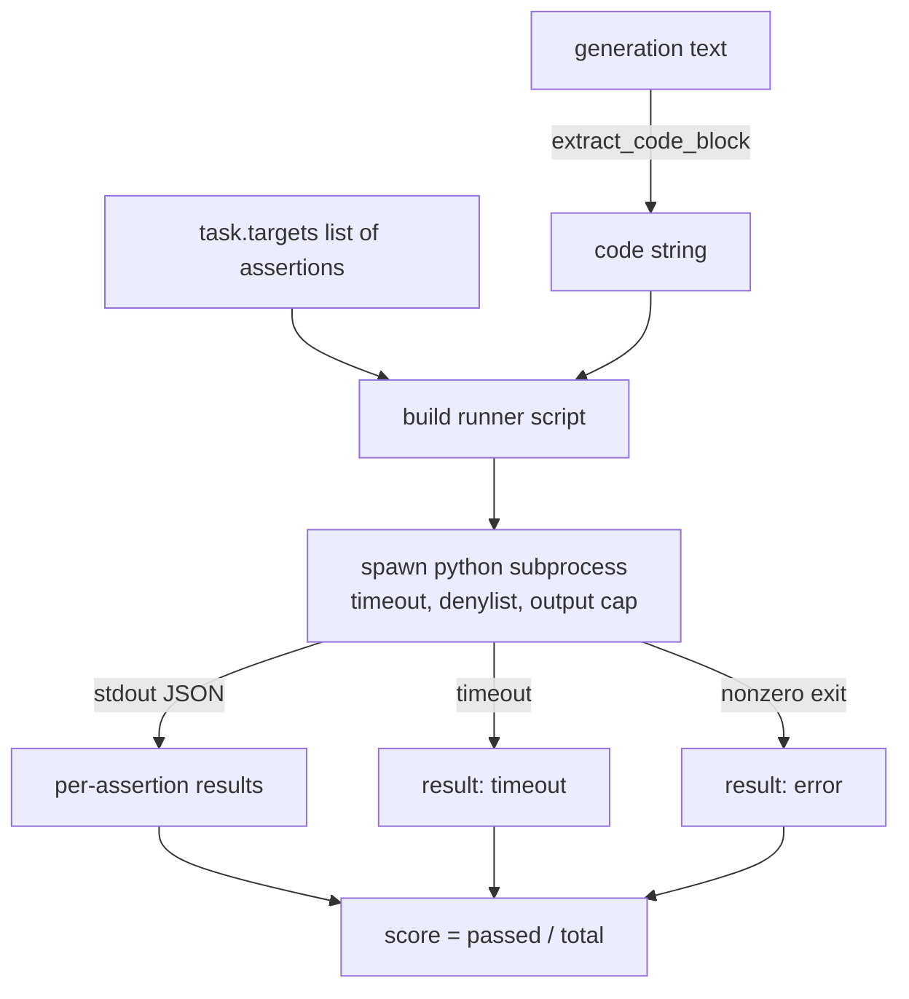
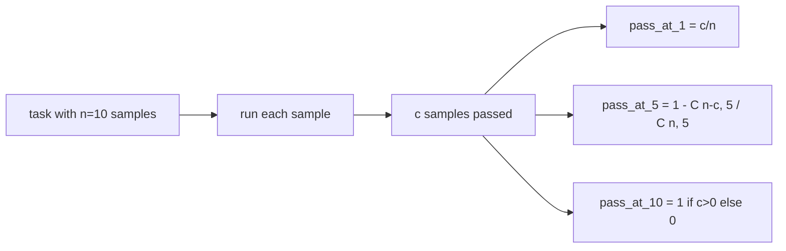

# 代码执行指标

> 生成的代码在通过测试时才是正确的。评估工具必须提取代码、在不崩溃主机的情况下运行它，并诚实地统计通过率。本课构建这个接口。

**类型：** 构建
**语言：** Python
**前置要求：** 第19阶段 Track B 基础，课程70 和 71
**所需时间：** 约90分钟

## 学习目标

- 以匹配第 70 课后处理规则的方式从自由形式生成中提取代码块。
- 在隔离的子进程中执行候选代码，带有挂钟时间限制、输出上限和导入黑名单。
- 将任务评分计算为提供的断言字符串通过候选的比例。
- 对从一个模型采样多个生成的任务计算 pass-at-k。
- 将沙箱崩溃、语法错误和超时视为一等失败模式，带有运行器可以记录的不同退出码。

## 为什么使用隔离子进程

内联 `exec` 是安全和稳定性隐患。生成的 `while True: pass` 会永远阻塞评估。生成的 `import shutil; shutil.rmtree('/')` 和听起来一样灾难性。修复方法是为每个候选生成一个全新的 Python 解释器，通过 stdin 传递代码，将断言结果写入 stdout，如果超时则杀死进程。主机评估进程继续运行。

HumanEval、MBPP、BigCodeBench 和 LiveCodeBench 等真实评估都使用子进程沙箱。有些在上面叠加 Docker。我们止步于子进程是有原因的：它是可移植的，它是标准库的，并且它捕获了对教育评估重要的失败模式。生产部署添加 seccomp、网络隔离和只读文件系统。下一课关于加固的内容不在此 Track 中。

## 代码执行任务的形状

一个 `code_exec` 任务在 `targets` 中携带断言字符串。运行器从生成中提取一个围栏代码块，在其周围构建一个测试运行器，并运行结果。



分数是 `[0, 1]` 范围内的比例。有三个断言通过两个的任务分数为 0.667。无论什么失败，运行器都返回相同的形状：子进程崩溃映射为规范化的错误码，而非 Python 回溯冒泡到工具中。

## 黑名单

黑名单基于导入。在运行候选代码之前，运行器脚本将危险模块的导入重写为抛出 `ImportError("denied")` 的桩。列表有意保守：`os.system`、`subprocess`、`socket`、`requests`、`urllib`、`urllib.request`、`urllib.error`、`urllib.parse`、`ctypes`、`shutil`、`http.client`、`asyncio.subprocess`。

我们不假装这是坚不可摧的。有意的对抗代码可以逃逸 Python 中任何进程内沙箱。黑名单是最后防线。挂钟时间限制和输出上限是承重控制。

```python
DENIED = {
    "os.system": True,
    "subprocess": True,
    "socket": True,
    "shutil": True,
    "requests": True,
    "urllib": True,
    "ctypes": True,
}
```

我们通过在前面添加 `import sys` 和一个将 `os.system` 猴子补丁为抛出异常的守卫来包装候选。完整模板在 `main.py` 中。

## 挂钟时间限制

每个子进程获得默认三秒的挂钟时间预算。运行器使用 `subprocess.run(..., timeout=t)`。如果超时触发，运行器捕获 `TimeoutExpired`，杀死进程，并为该任务记录 `timeout` 退出原因。该任务的分数为零。运行器继续。

超时可通过 `task.metadata.timeout_s` 按任务配置。长时间运行的单元测试可以请求更多时间；第 70 课的验证器将值限制在三十秒以保持套件有界。

## 输出上限

子进程可以淹没 stdout，耗尽主机内存。运行器将 stdout 流式读入缓冲区，当累计总量超过 256 KB 时立即杀死子进程。结果记录为 `exit_code = error`，详情字符串为 `"output overflow"`。当生成意外编写了一个打印的无限循环时，这在实践中会出现。

## Pass-at-k

Pass-at-k 是 HumanEval 等使用的无偏估计器。给定每个任务 `n` 个独立样本，其中 `c` 个通过，从 `n` 个中抽取大小为 `k` 的样本包含至少一个通过解的概率是：

```
pass_at_k(n, c, k) = 1 - C(n - c, k) / C(n, k)
```

当 `n - c < k` 时分子未定义，值为 `1`。实现直接处理边界情况。我们暴露 `pass_at_k(n, c, k)` 供第 74 课的排行榜层使用。



## 退出码

运行器对每个任务返回五种结果之一：

- `pass`：每个断言都通过。
- `assertion_fail`：代码运行了但至少一个断言失败。
- `syntax_error`：代码无法导入或有语法错误。
- `timeout`：挂钟时间到期。
- `error`：任何其他崩溃，包括黑名单命中和输出溢出（溢出以详情 `"output overflow"` 呈现）。

分数仍然是比例。退出码是元数据。下游课程可以决定将超时计为零还是缺失数据。

## 本课不做什么

它不给你一个真正的沙箱。它不运行来自开放网络的不受信任代码。它不处理有状态的任务如文件 I/O 或网络调用。那些需要容器或微虚拟机。本课的重点是契约：一个隔离的子进程、一个黑名单、一个超时、一个输出上限、一个干净的退出码词表和 pass-at-k 数学。

## 如何阅读代码

`main.py` 定义了 `extract_code`、`run_candidate`、`score_code_exec` 和 `pass_at_k`。子进程运行器脚本作为字符串构建，通过 `-c` 传递给全新的 Python 解释器。`code/tests/test_exec.py` 中的测试对 HumanEval 风格的计算示例验证四个退出码加上 pass-at-k。

从头到尾阅读 `main.py`。运行器模板是承重点。盯着断言循环，直到你能预测它写回父进程的 JSON 信封。

## 延伸阅读

一旦子进程形状工作了，下一个关注点是可移植性。不同 Python 版本在 Windows 上处理 SIGKILL 的方式不同。最干净的修复是将运行器放入 Docker 镜像。之后是将断言字符串替换为真实的单元测试文件，使评估匹配生产 CI 的做法。到那时就不要再叫断言字符串为测试了；它们是玩具测试，有玩具式的失败模式。
