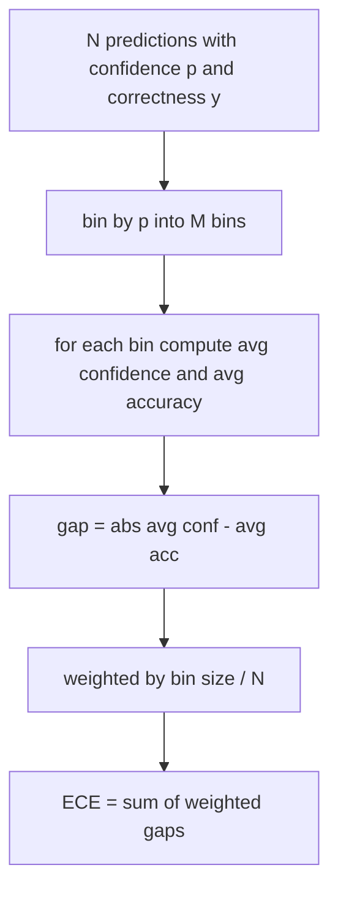
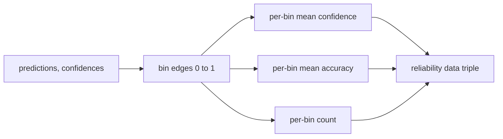

# 困惑度与校准

> 如果你的模型对一千个答案声称 90% 置信度，但只答对了六百个，它就不是校准良好的。校准是可信评估的一半。另一半是困惑度，它告诉你模型是否认为留出的文本是合理的。

**类型：** 构建
**语言：** Python
**前置要求：** 第19阶段 Track B 基础，课程70 和 71
**所需时间：** 约90分钟

## 学习目标

- 从模型适配器提供的 token 负对数概率计算留出语料库上的 token 级别困惑度。
- 从分箱的预测概率计算分类器或多选评估的期望校准误差（ECE）。
- 计算布里尔分数（相对于正确性指示的均方误差），并解释它何时能做 ECE 做不到的事。
- 构建绘制置信度-准确率曲线所需的可靠性图数据。
- 将三者都接入评估工具，使运行器可以在模型报告上附加 `perplexity`、`ece` 和 `brier` 数字。

## 困惑度告诉你什么

困惑度是每个 token 的指数化平均负对数似然。越低越好。困惑度为一意味着模型对每个实际 token 分配概率为一。困惑度为词表大小意味着模型是均匀的，什么都没学到。真实数字介于两者之间：一个强大的 2026 年基础模型在 WikiText-103 上大约在八到十二之间。一个差的在同样文本上在五十以上。

工具本身不计算对数概率。这些来自模型适配器。工具负责聚合：它接收每 token 的对数概率列表、每个序列的 token 计数列表，返回语料库困惑度。

```python
def perplexity(neg_log_probs, token_counts):
    total_nll = sum(neg_log_probs)
    total_tokens = sum(token_counts)
    return math.exp(total_nll / total_tokens)
```

实现处理零 token 的边界情况，并断言负对数概率非负。一个常见错误是忘记取反：一个返回 `log p` 而非 `-log p` 的适配器会产生低于一的困惑度，这是不可能的。函数将此捕获为契约违规。

## ECE 衡量什么

期望校准误差将预测按置信度分组到固定数量的箱中，然后测量跨箱的置信度和准确率之间的平均差距，按箱大小加权。



标准公式使用 `[0, 1]` 上的十个等宽箱。实现支持任何正整数计数。我们暴露一个 `bins` 参数，使运行器可以在发表惯例（10）和比较惯例（15）之间选择。

ECE 受箱数和样本量偏差影响。十个箱和一百个预测，你无法区分 0.02 ECE 和随机噪声。实现返回已填充箱的数量以及 ECE，使运行器可以在样本太少时拒绝报告单一数字。

## 布里尔分数能做 ECE 做不到的事

ECE 只关心平均差距。一个在一半箱上过度自信、在另一半上不够自信的模型可以在局部校准不良的同时有低 ECE。布里尔分数对每个预测测量相对于真实结果的平方误差，因此它直接惩罚分散度。

对于二值结果，布里尔是 `mean((p_i - y_i)^2)`。它分解为可靠性、分辨力和不确定性。我们计算分数和分解。运行器报告标量，但为仪表板记录分解。

```python
def brier(p, y):
    return float(np.mean((p - y) ** 2))
```

## 可靠性图数据

可靠性图在每个箱中绘制预测置信度相对于经验准确率。对角线是完美校准。函数返回三个数组：每箱平均置信度、每箱平均准确率和每箱计数。绘图代码在下游；本课止步于数据形状。



返回的元组是调用层绘制图表或计算自定义 ECE 变体（自适应 ECE、扫描 ECE 等）所需要的。我们返回 numpy 数组，使下游代码无需转换。

## 置信度来源

工具不假设置信度来自 softmax。它接受每个预测的任何 `[0, 1]` 范围内的数字。对于多选任务，自然置信度是 `softmax over option log-likelihoods`。对于自由文本，自然置信度是模型自报的概率或平均对数似然的指数。评估只是消费数字。它来自哪里是适配器的工作。

## 边界情况

- 所有预测错误：ECE 是平均置信度，布里尔很高，困惑度是模型对文本的看法。
- 所有预测正确且高置信度：ECE 接近零，布里尔接近零。
- 完全不确定的预测器在 p=0.5：ECE 是 0.5 减去准确率，布里尔是 0.25 减去修正项。
- 空输入：ECE、布里尔和可靠性返回 `0.0`（或零填充数组）。困惑度对零 token 情况返回 `NaN`。这些路径都不发出警告；运行器检查值并决定是报告还是跳过。

这些情况都固化在测试中。真实模型在真实基准上不会遇到它们，但有 bug 的适配器或微小样本会遇到，运行器不应该崩溃。

## 分发

校准不是像 F1 那样的每任务指标。它是每模型报告。运行器在整个评估中累积 `(confidence, correct)` 对，计算一次 ECE、布里尔和可靠性数据。困惑度在留出文本语料库上计算，与逐任务评分分开。

接口是：

```python
report = CalibrationReport.from_predictions(confidences, correct)
report.ece          # float
report.brier        # float
report.reliability  # tuple of three numpy arrays
report.populated_bins  # int
```

`PerplexityResult.from_token_nll(neg_log_probs, token_counts)` 返回困惑度和每个 token 的平均负对数似然。

## 本课不做什么

它不调用模型。它不实现 softmax。它不从输出 token 估计置信度；那是适配器的工作。它不做温度缩放或 Platt 缩放；那些是后处理修复，属于不同的课程。本课的重点是使三个数字（困惑度、ECE、布里尔）可信且可复现。

## 如何阅读代码

`main.py` 定义了 `perplexity`、`expected_calibration_error`、`brier_score`、`reliability_diagram` 以及 `CalibrationReport` / `PerplexityResult` 数据类。演示在合成预测上运行，其中真实标签已知：一个校准良好的模型、一个过度自信的模型和一个不够自信的模型。`code/tests/test_calibration.py` 中的测试固定每个边界情况以及合成预测器的参考值。

从头到尾阅读 `main.py`。函数排序从标量到向量到报告。每个函数有简短的文档字符串，包含数学和契约。

## 延伸阅读

校准是已发表评估中最被忽视的维度。大多数排行榜报告一个单一准确率数字就算完成了。一个在准确率上获胜但在布里尔上失败的模型，比一个准确率低几分但可靠报告不确定性的模型更不适合生产部署。一旦你有了校准管道，在留出验证切片上添加温度缩放，重新计算 ECE，看着差距缩小。那是单独的课程，但基础在这里。
