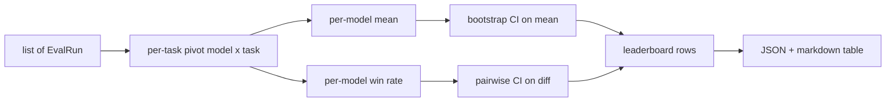
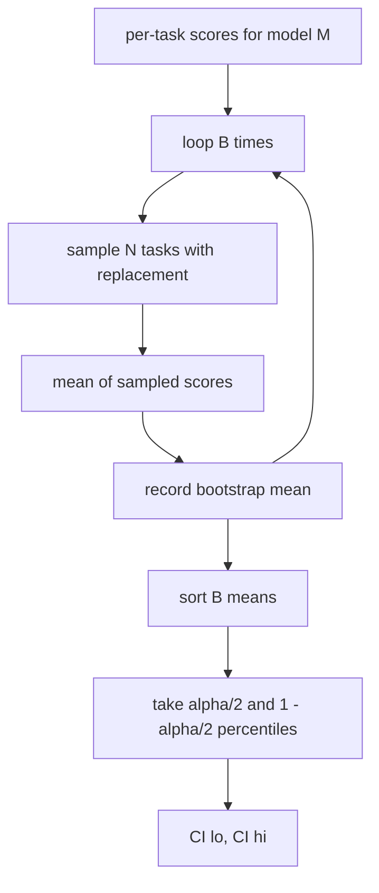

# 排行榜聚合

> 单个任务的分数好算。跨异构任务的模型排名就难了。千条预测的排行榜上统计显著性才是所有人都跳过的部分。本课不跳过。

**类型：** 构建
**语言：** Python
**前置要求：** 第19阶段 Track B 基础，第70、71、73课
**所需时间：** 约90分钟

## 学习目标

- 将多个模型在多个任务上的分数聚合成整齐的每模型一行。
- 归一化异构分数，使通过率和 BLEU 值不会过度影响聚合结果。
- 按平均分和胜率对模型排名，并解释各自的适用场景。
- 计算每个模型平均分的 bootstrap 置信区间以及两两差异的置信区间。
- 将排行榜输出为 JSON 报告和 markdown 表格，供第75课的运行器粘贴到 CI 评论中。

## 输入的形状

聚合器消费一组 `EvalRun` 记录：

```python
@dataclass
class EvalRun:
    model_id: str
    task_id: str
    metric_name: str
    score: float          # in [0, 1]
    category: str
```

第75课的运行器为每对 `(model, task)` 输出一条记录。聚合器不关心分数是怎么产生的，它期望归一化已经完成：每个分数都在 `[0, 1]` 范围内。

## 输出

产出三张表：



排行榜每行包含：`model_id`、`mean_score`、`mean_ci_lo`、`mean_ci_hi`、`win_rate`、`tasks_completed`，以及一个可选的 `categories` 映射用于按类别统计平均分。

## 归一化

如果一个任务的分数在 `[0, 1]` 范围内，另一个在 `[0, 100]` 范围内，后者会无声地主导平均值。聚合器验证每个输入分数是否在 `[0, 1]` 范围内，否则拒绝该次运行。修复需要在上游进行：指标本身就应该返回一个比例值。第71到73课强制执行了这一约定。

## 平均分与胜率

两种排名方式服务于不同的目标。

平均分是一个模型在所有任务上的分数平均值，是排行榜报告的核心数字。它对异常值和任务不平衡敏感。

胜率统计一个模型在同一任务上击败其他所有模型的频率。对于每个任务，分数最高的模型获胜（平局则均分）。胜率等于获胜次数除以模型有分数的任务数。它对异常值和量纲差异不太敏感，但会丢失信息。

```python
def win_rate(model_id, runs_by_task, all_models):
    wins, total = 0, 0
    for task_id, runs in runs_by_task.items():
        scores = {r.model_id: r.score for r in runs if r.model_id in all_models}
        if model_id not in scores:
            continue
        total += 1
        best = max(scores.values())
        if scores[model_id] >= best:
            wins += 1
    return wins / total if total else 0.0
```

测试框架同时报告两者。第75课的运行器默认按平均分排名；胜率列也一并提供，方便用户按需选择。

## Bootstrap 置信区间

每个模型的平均分附带一个通过对任务进行 bootstrap 重采样估计的置信区间。我们对任务 ID 进行有放回重采样，在重采样集上计算平均值，重复 `B` 次，然后在 `alpha` 水平下取百分位区间。



对于两两比较，我们对逐任务差异 `score_A - score_B` 进行 bootstrap，取百分位区间并报告。用户读取区间是否排除零。如果排除，则在 alpha 水平下差异显著。如果不排除，排行榜将两个模型视为平手。

底层辅助函数（`bootstrap_mean_ci`、`bootstrap_pairwise_diff`）默认 `B=1000`；公共聚合器（`aggregate`、`pairwise_diffs`）默认 `b=500`，以保持演示和测试的快速。默认 alpha 为 0.05。本课的 bootstrap 使用纯 numpy 实现，不依赖 scipy。

## 类别

如果设置了 `EvalRun.category`，聚合器还会报告按类别的平均分。这就是每个排行榜上标注 `math`、`reasoning`、`code`、`safety` 的那列。它能让运行者发现某个模型整体不错但在代码方面较弱——这是核心平均分隐藏的信息。

## Markdown 渲染

排行榜渲染为 markdown 表格：

```text
| Rank | Model | Mean | 95% CI | Win rate | Tasks |
|------|-------|------|--------|----------|-------|
| 1    | gpt   | 0.78 | 0.74-0.82 | 0.62 | 50 |
| 2    | claude| 0.75 | 0.71-0.79 | 0.34 | 50 |
| 3    | random| 0.10 | 0.07-0.13 | 0.04 | 50 |
```

表格按平均分排序。置信区间渲染到小数点后两位。过长的模型 ID 截断为20个字符。

## 本课不做什么

本课不运行模型。不调用指标层。不实现自适应 ECE 或其他校准变体——那些在第73课。不实现任务加权。这里每个任务权重相同。生产排行榜会加权任务；我们通过 `weight` 字段留了钩子，但在聚合器中忽略它。如果需要加权，请在后续课程中添加。

## 如何阅读代码

`main.py` 定义了 `EvalRun`、`LeaderboardRow`、`aggregate`、`bootstrap_mean_ci`、`bootstrap_pairwise_diff` 和 `render_markdown`。演示构建了一个包含三个模型和十二个任务的合成套件，执行聚合，并打印排行榜和两两差异表。`code/tests/test_leaderboard.py` 中的测试固定了 bootstrap、markdown 渲染、胜率边界情况和空输入行为。

从上到下阅读 `main.py`。数据形状（EvalRun、LeaderboardRow）在前，聚合器其次，bootstrap 第三，渲染最后。每个函数都有明确的职责约定。

## 延伸阅读

自然的下一步是配对任务显著性检验，而非非配对 bootstrap。如果模型 A 和 B 都运行了相同的100个任务，适当的检验是对逐任务差异的配对 bootstrap——我们已经实现了。更进一步，你可能需要一个尊重任务族的分层 bootstrap（数学问题之间并不独立；一个算术错误模式会影响其中十个）。这是后续内容。本课的重点是把基础做对，让评估报告产出一个你站得住脚的数字。
