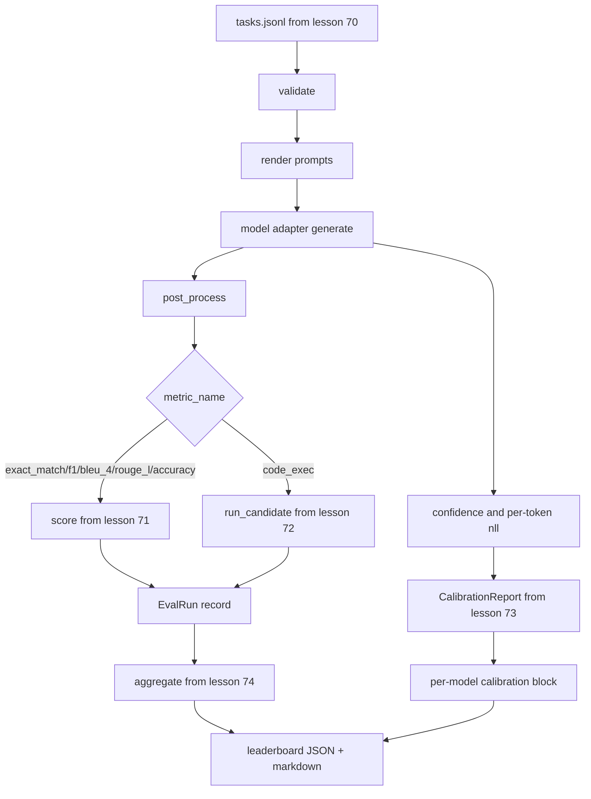

# 端到端评估运行器

> 五节课的管道搭建，一节课的集成粘合。运行器读取第70课的任务规格，通过适配器调用模型，用第71和72课打分，附上第73课的校准报告，输出第74课的排行榜。演示自动终止。

**类型：** 构建
**语言：** Python
**前置要求：** 第19阶段 Track B 基础，第70至74课
**所需时间：** 约90分钟

## 学习目标

- 定义一个 `ModelAdapter` 接口，任何模型（模拟的、本地的、API）都能用少量方法满足。
- 在 fixture JSONL 文件上运行评估，通过工作线程池并行执行任务。
- 将指标层（exact_match、F1、BLEU-4、ROUGE-L、code_exec）与校准层组合为一次通过。
- 输出每模型的 `EvalRun` 记录并直接馈入排行榜聚合器。
- 同时输出 JSON 报告和 markdown 表格；正常运行时以退出码零自终止，校验或运行时失败则以非零退出。

## 管道



运行器是集成点。第70到74课各负责一个模块，运行器将它们组合。运行器不重复那些模块的任何逻辑：它导入它们。

## 适配器接口

适配器是运行器与任何模型之间的接缝。接口故意设计得很小。

```python
class ModelAdapter:
    model_id: str

    def generate(self, prompt: str, task: TaskSpec) -> Generation: ...
```

`Generation` 是一个数据类，包含：

- `text`：模型的自由形式输出
- `confidence`：`[0, 1]` 范围的浮点数，表示模型对答案的自报概率
- `token_nll`：生成 token 的负对数似然之和（可选）
- `token_count`：生成的 token 数量（可选）

运行器中的模拟适配器提供三种风格：`RuleBasedAdapter`（确定性、近乎完美）、`NoisyAdapter`（过度自信、经常出错）和 `BiasedAdapter`（擅长某类任务、其他很差）。演示在第70课的 fixture 上运行全部三种。

## 并行执行

运行器使用 `concurrent.futures.ThreadPoolExecutor` 按模型并行执行任务。工作线程数默认为8和任务数中的较小值。线程就足够了，因为真实模型调用的瓶颈在网络 I/O。code-exec 路径在任务内部启动自己的子进程，执行器只调度等待。

为了确定性测试，运行器暴露 `run_eval(adapters, tasks, parallel=False)` 让测试固定执行顺序。

## 单次通过评分循环

对每个任务：

1. 渲染提示（few-shot 前缀加上提示主体）。
2. 调用适配器并计时。
3. 按任务规则后处理生成结果。
4. 分派到指标层。
5. 用分数和指标元数据构建 `EvalRun` 记录。
6. 将 `(confidence, correct)` 对追加到校准缓冲区。

`correct` 信号对于 exact_match 风格指标（`exact_match`、`accuracy`、`code_exec`）是 `score >= 1.0`，对于分级指标是 `score >= 0.5`。阈值在 `_correct_from_score` 中，运行器不暴露公共覆盖。

## 聚合

每个任务都有结果后，运行器调用第74课的 `aggregate` 和 `pairwise_diffs` 以及第73课的 `CalibrationReport.from_predictions`。输出是一个 JSON 信封：

```json
{
  "leaderboard": [...],
  "pairwise": [...],
  "calibration": {
    "model_id_a": {"ece": 0.04, "brier": 0.10, "populated_bins": 8, ...},
    ...
  },
  "summary": {
    "tasks": 10,
    "models": 3,
    "wall_seconds": 1.2
  }
}
```

运行器还将 markdown 表格写入标准输出，方便用户粘贴到 PR 审阅中。

## 自终止演示

演示在第70课的10个 fixture 任务上运行三个模拟适配器。墙钟时间应在10秒以内。正常运行时退出码为零。

正常运行的条件是：

- 每个任务在第70课下通过校验。
- 每个任务在第71和72课下通过评分。
- 校准报告在第73课下无错误聚合。
- 排行榜将基于规则的适配器严格排在随机适配器之上。

如果任何条件不满足，运行器以非零退出码退出，并在 JSON 信封中输出结构化错误。

## 本课不做什么

本课不调用真实模型。不实现 API 密钥流程或速率限制处理。不实现流式或部分生成；适配器每次调用返回一个完整的生成结果。不做重试或缓存。这些关注点在适配器层；运行器对指标和提供商都是无感的。

## 如何阅读代码

`main.py` 是集成入口。它通过一个小的 `_load_sibling` 辅助函数按相对路径导入其他五个课程模块。数据类 `Generation`、`EvalReport` 和 `ModelAdapter` 在本地定义。模拟适配器在文件底部。

从上到下阅读 `main.py`。先浏览导入，然后看 `run_eval`，再看 `_score_one`，最后看适配器。末尾的演示是入口点。

`code/tests/test_runner.py` 中的测试固定了适配器接口、单次通过循环、并行与顺序等价性、校准缓冲区和 JSON 信封形状。

## 延伸阅读

这个运行器是基础。生产评估系统增加：以 `(task_id, model_id, model_version)` 为键的结果缓存、追踪每次运行的美元和 token 成本的成本账本、在速率限制时退避的重试层、pass-at-k 任务的采样策略，以及长套件的流式输出格式。每一项都是一个单独的关注点，包装运行器而不改变指标或聚合层。这种分离就是约定的价值所在。

在模拟适配器工作后，为真实提供商添加适配器。选一个有免费额度的，写三十行粘合代码，看排行榜亮起来。然后添加第二个提供商，让测试框架完成剩下的工作。
