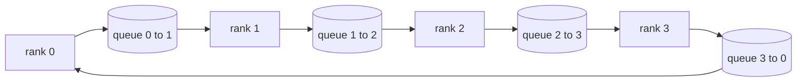

# 从零实现集合通信

> 支撑分布式训练的四种集合操作是 allreduce、broadcast、allgather 和 reduce_scatter。训练框架提供的其他原语都是对这些的封装。在 `multiprocessing.Queue` 网格上构建一次，用参考实现验证，本阶段的其余内容就只是管道工程了。

**类型：** 构建
**语言：** Python
**前置要求：** 第19阶段 Track C 第42-49课
**所需时间：** 约90分钟

## 学习目标

- 用两次传递（reduce-scatter 然后 allgather）实现环形 allreduce，并证明每个 rank 的通信量为每元素 2(N-1)/N 字节。
- 在 `multiprocessing.Queue` 上的点对点发送之上构建 broadcast、allgather 和 reduce_scatter。
- 用 `torch.distributed` gloo 参考实现对每个原语进行相同输入的验证。
- 根据集群形状、延迟下限和带宽上限论证环形与树形拓扑的选择。

## 问题所在

朴素的 allreduce 在 N 个 rank 上将张量发送 N 次到根节点，再广播 N 次回来。带宽按 O(N)/rank 缩放，根节点成为瓶颈，墙钟下限是最慢链路乘以 N。环形 allreduce 将其扁平化为 2(N-1) 个大小为 T/N 的块，因此每个 rank 的字节数降为 2T(N-1)/N，与集群大小无关。树形 allreduce 在小 N 和高延迟链路上有优势，因为深度是 log2(N) 跳而非 2(N-1)。为集群形状选错拓扑，最慢的 GPU 决定了步进时间。

你在本阶段会读到的每个分布式训练框架都依赖这四种原语。PyTorch DDP 每个参数桶用一次 allreduce 同步梯度。ZeRO 通过 reduce_scatter 分片优化器状态，通过 allgather 广播更新后的参数。FSDP 将整个前向转为 allgather 加 reduce_scatter。流水线并行需要 broadcast 来跨阶段组传递激活。如果你不能实现这四种集合通信，你就无法推理为什么训练卡住、为什么梯度不匹配出现在 rank 3、或者为什么切换拓扑时流水线气泡翻倍。

## 概念说明



### 两次传递的环形 allreduce

将张量分成 N 个等大的块，索引为 0..N-1。每个 rank 拥有与其 rank 编号相同的块。第一遍 reduce-scatter 运行 N-1 步。在步 s，rank r 将块 (r - s) mod N 发送给 rank (r + 1) mod N，并从 rank (r - 1) mod N 接收块 (r - s - 1) mod N，将接收到的块累积到本地副本中。N-1 步后，rank r 拥有块 r 的完整求和。第二遍 allgather 再运行 N-1 步，将完成的块在环上旋转，直到每个 rank 拥有每个块的完整求和。

| 原语 | 每 rank 字节数 | 步数 | 适用场景 |
|------|---------------|------|---------|
| 环形 allreduce | 2T(N-1)/N | 2(N-1) | 大 T、宽带宽同构集群 |
| 树形 allreduce | T log2(N) | 2 log2(N) | 小 T 或高延迟链路 |
| Broadcast | T | log2(N) 树 | 参数初始化、标量配置 |
| Allgather | T(N-1)/N | N-1 | 分片前向、ZeRO 反分片 |
| Reduce_scatter | T(N-1)/N | N-1 | ZeRO 梯度分片 |

### 队列网格作为 NCCL 的替代

NCCL 在 PCIe 和 NVLink 上运行，带硬件卸载的归约。在 CPU 上你没有这些。每个环边一个 `multiprocessing.Queue` 给你有序的点对点传递，单生产者单消费者。归约在用户空间发生，所以你付出 Python 开销，但通信模式与 NCCL 环形 allreduce 完全一致。在队列版本上推理正确性，集群行为自然随之而来。

### 用 gloo 验证

每个原语附带一个单元测试，将输出与使用 gloo 后端初始化的 `torch.distributed` 在相同张量、相同 world size 上的输出进行比较。如果你的环形 allreduce 与 gloo 的差异超过 float32 epsilon，测试就会失败。用参考实现验证是不可妥协的；没有它，原语看起来正确直到真实训练运行的第 10000 步。

## 开始构建

`code/main.py` 实现了：

- `Mesh` 类：将 N 个 `multiprocessing.Queue` 实例连接成环，为每个 rank 暴露 `send(dst, tensor)` 和 `recv(src)`。
- `ring_allreduce(mesh, rank, world_size, tensor)`：运行两遍算法。
- `broadcast(mesh, rank, world_size, tensor, src)`：基于对数树。
- `allgather(mesh, rank, world_size, tensor)`：使用 N-1 次旋转。
- `reduce_scatter(mesh, rank, world_size, tensor)`：作为 allreduce 的前半部分。
- `_gloo_reference(op, world_size, tensor)`：用 gloo 通过 `torch.distributed` 运行相同输入，进行字节级比较。

运行：

```bash
python3 code/main.py
```

输出：每个原语的验证表，比较队列网格和 gloo 的输出，随后是每个 rank 的字节计数器，证明 2T(N-1)/N 的缩放关系。

## 生产中的实战模式

三种模式将原语加固到可交付水平。

**allreduce 前对梯度分桶。** 一个10亿参数模型有数万个梯度张量。每次一个张量的 allreduce 要支付 N 次延迟下限。DDP 将梯度分组为约 25 MB 的桶，每个桶一次 allreduce；小张量搭大张量的便车。没有分桶，延迟开销就会主导步进时间。

**通信与计算重叠。** 反向传播按反序逐层计算梯度。最后一层梯度就绪的瞬间，启动它的 allreduce，同时下一层继续计算。PyTorch DDP 通过桶就绪钩子实现这一点。当网络有余量时，重叠将可见通信时间减半。

**按消息大小选择环形或树形，而非信仰。** NCCL 附带拓扑检测器，对约 1 MB 以上的消息选环形，以下选树形。交叉点在带宽与延迟之间：超过 1 MB，带宽项 2T(N-1)/N 主导，环形胜出；低于 1 MB，log2(N) 跳数胜出。硬编码一种拓扑会在错误的消息大小上损失吞吐量。

## 实际使用

生产模式：

- **PyTorch DDP。** 反向后对分桶的梯度调用 `dist.all_reduce`。桶大小可调；默认 25 MB 对 100Gbit 以太网合理。
- **DeepSpeed ZeRO。** 发起 reduce_scatter 分片梯度，allgather 在前向前重建完整参数。本课的原语正是 ZeRO 调用的操作。
- **FSDP。** 前向以 allgather 开始反分片层，计算后用 reduce_scatter 归约并丢弃反分片。相同原语，不同调度。

## 交付使用

在第77-81课中使用队列网格原语。第77课将 allreduce 接入 DDP。第78课将 reduce_scatter 接入 ZeRO。第79课将 broadcast 接入流水线激活。第81课将四种原语组合到端到端演示中。

## 练习

1. 添加树形 allreduce 变体，按消息大小在环形和树形之间切换。测量交叉点。
2. 添加 `recv_timeout_ms`，使停滞的 rank 报出截止时间错误而非永远挂起。
3. 用 TCP 套接字替换 `multiprocessing.Queue` 实现四种原语。相同测试，真实网络。
4. 添加带宽检测钩子，使每 rank 的字节计数器记录到 JSONL。
5. 在 4 个 rank 上比较环形与树形在 1KB、1MB、16MB 张量上的墙钟时间。用经验数据论证交叉点。

## 关键术语

| 术语 | 常见说法 | 实际含义 |
|------|---------|---------|
| Allreduce | "跨 rank 求和" | 调用后每个 rank 持有相同的归约张量 |
| Ring | "快速拓扑" | N-1 个大小为 T/N 的块在环上流动两次 |
| Tree | "对数拓扑" | 归约沿二叉树进行；深度为 log2(N) 跳 |
| Allgather | "拼接分片" | 每个 rank 最终持有其他所有 rank 的分片 |
| Reduce_scatter | "拆分求和" | 每个 rank 最终只持有一个块的求和 |
| Bucket | "融合小张量" | 将 N 次小 allreduce 合并为一次大的 |

## 延伸阅读

- [PyTorch Distributed: NCCL collectives](https://pytorch.org/docs/stable/distributed.html#collective-functions)
- [Horovod ring allreduce paper](https://arxiv.org/abs/1802.05799)
- [NCCL topology and algorithm selection](https://docs.nvidia.com/deeplearning/nccl/user-guide/docs/index.html)
- [Patarasuk and Yuan, Bandwidth optimal allreduce algorithms](https://www.cs.fsu.edu/~xyuan/paper/09jpdc.pdf)
- 第10阶段第05课 - 分布式训练概览
- 第19阶段第77课 - 基于这些原语构建的 DDP
