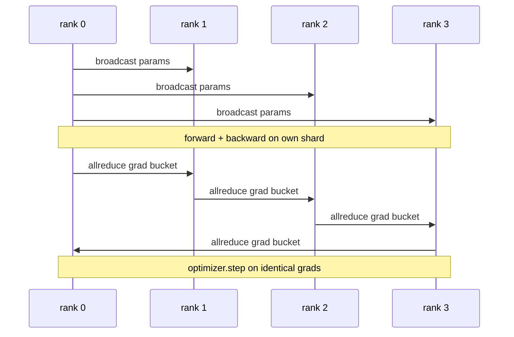

# 从零实现数据并行 DDP

> DistributedDataParallel 是 allreduce 之上的一个钩子。包装一个模型，从 rank 0 广播初始参数使每个 rank 起点相同，在每个参数上安装一个反向钩子来发起梯度 allreduce，剩下的就是梯度下降了。整个模式大约 200 行。

**类型：** 构建
**语言：** Python
**前置要求：** 第19阶段 Track C 第42-49课
**所需时间：** 约90分钟

## 学习目标

- 实现一个 `DistributedDataParallel` 风格的包装器，广播初始参数并在反向后 allreduce 梯度。
- 使用 `torch.multiprocessing.spawn` 在 gloo 后端上通过基于文件的 rendezvous 启动 N 个 CPU rank。
- 通过在相同数据上顺序训练相同模型，证明每步参数等价性来验证梯度同步的正确性。
- 论证分桶（梯度融合）和重叠（反向期间通信）作为将工作 DDP 变为生产 DDP 的两项关键改进。

## 问题所在

一个10亿参数、12 GB 激活的模型放不进一块消费级 GPU。即使放得下，训练也需要数周。数据并行将批次拆分到 N 个 rank，每个 rank 在自己的分片上前向和反向，每一步所有 rank 的梯度被求和，使所有 N 个副本保持一致。求和后的梯度供优化器步进。

没有梯度同步，N 个副本在第2步就发散了。模型不再是"一个在更多数据上训练的模型"，而是 N 个碰巧共享初始权重的独立模型。梯度同步做得很差时（每个参数一次 allreduce、无重叠、无分桶），网络成为瓶颈，GPU 空闲等待线路。DDP 的工艺在于让梯度同步相对于计算几乎免费。经典 PyTorch DDP 通过分桶梯度、将 allreduce 与下一层的反向重叠、以及在 NVLink 上使用 NCCL 来实现。我们可以在 CPU 上用 gloo 完成全部三项并学到相同的教训。

## 概念说明



### DDP 需要的三种操作

| 阶段 | 集合通信 | 原因 |
|------|---------|------|
| 初始化 | 从 rank 0 broadcast | 每个 rank 以相同参数开始 |
| 反向后 | 每个梯度的 allreduce | 优化器步进的是均值梯度 |
| 按需 | buffer 的 broadcast | BatchNorm 运行统计保持同步 |

### 为什么是均值而非求和

Allreduce-SUM 除以 world_size 得到均值梯度。均值对 world_size 不变：在一个 rank 上调好的学习率在四个 rank 上也能用，因为每步的梯度幅度不变。不除以 world_size 的 Allreduce-SUM 会迫使你每次改变集群大小都重新调学习率。DDP 包装了 SUM 并做除法；本课也这样做。

### 为什么分桶梯度

一个 Transformer 有数千个参数张量。每个张量一次 allreduce 要支付数千次 gloo 延迟下限。DDP 将梯度分组为约 25 MB 的桶，每个桶一次 allreduce。相同的总字节数在线路上传输，但延迟被桶摊销。对于本课的小模型，我们将所有梯度放入一个桶；结构是可迁移的。

### 为什么固定随机种子

每个 rank 必须调用 `torch.manual_seed(seed + rank)` 来打乱顺序，但调用 `torch.manual_seed(seed)` 来初始化参数。单个共享种子意味着每个 rank 看到相同的批次顺序（违背数据并行的初衷）；参数使用 rank 特定种子意味着初始参数差一个浮点 epsilon，梯度同步不再使副本一致。种子模式搞对，否则第1步的参数等价性测试就会失败。

## 开始构建

`code/main.py` 实现了：

- `MiniMLP`：一个3层 MLP，小到几秒内收敛，大到足以暴露接线逻辑。
- `DistributedDataParallel(model, world_size)`：构造时广播参数，返回一个包装器，其 `sync_grads` 将累积的 allreduce 求和梯度除以 world_size。
- `worker(rank, world_size, ...)`：完整的训练循环，在 gloo 上初始化 `torch.distributed`，前向、反向、同步、步进。
- `_reference_single_process_loop(...)`：在单个 rank 上顺序训练相同模型和相同数据，测试用它来验证每步后参数字节级等价。

运行：

```bash
python3 code/main.py
```

输出：每步训练表，比较单进程的损失和参数校验和与 4 个 rank 的 DDP 运行。两条路径产生相同的损失曲线，精度到浮点 epsilon，证明梯度同步正确。

## 生产中的实战模式

三种模式将 DDP 加固到可交付水平。

**查找未使用参数。** 某些前向路径有条件地跳过参数（提前退出、混合专家路由器）。跳过的参数没有梯度，但 DDP 的桶就绪钩子仍在等待它们，allreduce 就会死锁。`find_unused_parameters=True` 告诉 DDP 在归约前检查哪些参数得到了梯度。代价是每步一次图遍历，所以除非你的前向有分支，否则关闭它。

**静态图优化。** 当前向在各步之间稳定时，`static_graph=True` 让 DDP 预计算桶调度。这个优化在规模上很重要：预计算每步节省几毫秒，在 10000 步中累积。

**梯度累积需要注意。** 在 K 个微批次上累积梯度而不在每个微批次同步，是 10 倍吞吐量的提升。DDP 将 `no_sync()` 作为上下文管理器暴露，暂停反向后的 allreduce。忘了管理器，你就白白 allreduce 了 K 次；吞吐量跌到谷底。

## 实际使用

生产模式：

- **PyTorch DDP。** 经典实现。`torch.nn.parallel.DistributedDataParallel(model)` 接入分桶、重叠和 no_sync 上下文。
- **HuggingFace Accelerate。** 添加处理 `torchrun` 环境变量和模型包装的启动器。底层是相同的 DDP。
- **Megatron-LM 数据并行。** 将 DDP 与张量并行结合用于大模型；数据并行部分是相同的反向后 allreduce 模式。

## 交付使用

第78课（ZeRO 分片）用 reduce_scatter 替换每参数的 allreduce，使每个 rank 只存储其优化器状态的分片。第81课将 DDP 与 ZeRO 组合到端到端演示中。

## 练习

1. 添加可配置大小的梯度桶，在更深的模型上测量与每参数一次 allreduce 相比的加速。
2. 将 `no_sync()` 实现为上下文管理器，验证梯度累积在 K 个微批次上与单进程基线匹配。
3. 添加 `find_unused_parameters` 模式，前向有时跳过 MLP 的某一层；没有该标志时运行应该死锁。
4. 用 `torch.distributed.barrier()` 替换 gloo，体验基于 allreduce 和基于 barrier 的同步的区别。
5. 在批次大小为 1、16、256 时测量梯度同步开销占步进时间的比例，并解释缩放关系。

## 关键术语

| 术语 | 常见说法 | 实际含义 |
|------|---------|---------|
| DDP | "数据并行" | 每步广播参数并 allreduce 梯度的包装器 |
| Bucket | "融合梯度" | 将 N 次小 allreduce 分组为一次大的 |
| Overlap | "隐藏通信" | 在后续层仍在计算反向时发起 allreduce |
| no_sync | "累积" | 跳过反向后的 allreduce 以进行梯度累积 |
| find_unused | "分支前向" | 在归约前检测无梯度的参数 |

## 延伸阅读

- [PyTorch DistributedDataParallel docs](https://pytorch.org/docs/stable/generated/torch.nn.parallel.DistributedDataParallel.html)
- [PyTorch DDP internals tutorial](https://pytorch.org/tutorials/intermediate/ddp_tutorial.html)
- [Li et al, PyTorch Distributed: Experiences on Accelerating Data Parallel Training](https://arxiv.org/abs/2006.15704)
- 第19阶段第76课 - DDP 构建于其上的集合通信
- 第19阶段第78课 - ZeRO 分片用 reduce_scatter 替换每参数 allreduce
