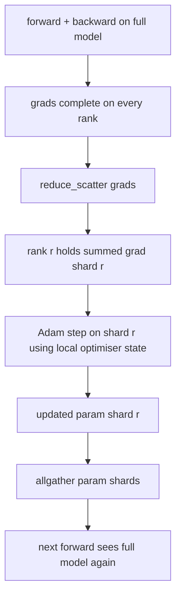

# ZeRO 优化器状态分片

> Adam 每个参数存储两个动量估计，都是 float32。一个70亿参数模型携带 56 GB 的优化器状态。ZeRO 第一阶段将其分片到 N 个 rank；每个 rank 拥有 1/N 的优化器。本地步进后，更新的参数分片广播回来，每个 rank 重建完整模型，下一步开始。收益是训练栈中最大单项分配的线性内存下降。

**类型：** 构建
**语言：** Python
**前置要求：** 第19阶段 Track C 第42-49课
**所需时间：** 约90分钟

## 学习目标

- 将优化器状态（一阶矩、二阶矩、fp32 主副本）分片到 N 个 rank，使每个 rank 拥有 1/N。
- 使用 reduce_scatter 将每个分片的梯度求和只送达对应 rank，然后 allgather 广播更新后的参数分片回来。
- 计算第一阶段、第二阶段、第三阶段相对于原版 DDP 的内存节省表。
- 根据模型大小和带宽预算论证第一阶段 vs 第二阶段 vs 第三阶段的选择。

## 问题所在

原版 DDP 复制一切：参数、梯度和优化器状态在每个 rank 上完整存在。对于一个 fp16 的70亿参数模型，这意味着每个 rank 14 GB 参数、14 GB 梯度和 28 GB 优化器状态。优化器状态是最大项，也是最容易分片的，因为它只在步进时被触及，不在前向或反向期间。

ZeRO 第一阶段分片优化器状态。每个 rank 持有 1/N 的 Adam 动量。反向后，ZeRO 不做 allreduce 完整梯度然后本地步进，而是做 reduce_scatter，使每个 rank 只接收其分片的梯度求和。rank 对其分片的主参数应用优化器步进。更新后的参数分片 then allgather 回来，使每个 rank 为下一次前向持有完整模型。优化器内存下降 N 倍。每步的线路通信与 DDP 相同：一次 reduce_scatter 加一次 allgather 在带宽上等于一次 allreduce。内存赢了，吞吐量持平。

## 概念说明



### ZeRO 的阶段

| 阶段 | 分片内容 | 每 rank 内存 | 每步通信 |
|------|---------|-------------|---------|
| DDP | 无 | 参数 + 梯度 + 优化器 | 1x allreduce |
| ZeRO-1 | 优化器状态 | 参数 + 梯度 + 优化器/N | 1x reduce_scatter + 1x allgather |
| ZeRO-2 | 优化器 + 梯度 | 参数 + 梯度/N + 优化器/N | 1x reduce_scatter + 1x allgather |
| ZeRO-3 | 优化器 + 梯度 + 参数 | 参数/N + 梯度/N + 优化器/N | 每层 1x allgather + 每层 1x reduce_scatter |

第一阶段是最便宜的收益，因为优化器状态主导了预算。第二阶段需要梯度分片累积逻辑，但带宽相同。第三阶段（FSDP）为每次前向和反向支付逐层通信，换取参数分片的内存下降。本课完整实现第一阶段。

### 内存计算，真实数字

对于一个 P 参数的模型用 Adam 混合精度训练：

| 项目 | 原版 | ZeRO-1 | 原因 |
|------|------|--------|------|
| fp16 参数 | 2P 字节 | 2P 字节 | 前向需要 |
| fp16 梯度 | 2P 字节 | 2P 字节 | 反向需要 |
| fp32 主副本 | 4P 字节 | 4P/N 字节 | 只有优化器使用 |
| fp32 一阶矩 | 4P 字节 | 4P/N 字节 | 只有优化器使用 |
| fp32 二阶矩 | 4P 字节 | 4P/N 字节 | 只有优化器使用 |
| 合计 | 16P 字节 | 4P + 12P/N 字节 |   |

N=8 时：原版 16P，ZeRO-1 5.5P，下降 65%。N=64 时：原版 16P，ZeRO-1 4.19P，下降 74%。

### 为什么 reduce_scatter 优于 allreduce 后分片

Allreduce 给每个 rank 完整的梯度求和。如果你只需要分片 r，rank r 上被归约的 (N-1)/N 梯度就是浪费的。Reduce_scatter 只送达每个 rank 拥有的分片；每 rank 字节数与 allreduce 相同（因为 allreduce 就是 reduce_scatter + allgather），但后半部分被稍后的参数分片 allgather 替代。净通信与 DDP 相同，内存被瓜分了。

## 开始构建

`code/main.py` 实现了：

- `flatten_params(module)` 和 `unflatten_into(module, flat)`：将模型的参数打包到一个连续张量中再解包回来。扁平布局使按 rank 分片变成简单的切片。
- `ZeroOptimizer(model, world_size, rank, lr)`：拥有该 rank 的主副本和 Adam 动量分片。
- `step()`：对扁平梯度运行 reduce_scatter，对 rank 的分片应用 Adam，然后 allgather 更新后的参数回来。
- 演示：训练一个3层 MLP 20步，打印每步内存预算与原版 DDP 基线的对比。

运行：

```bash
python3 code/main.py
```

输出：每步损失和内存表，显示 ZeRO-1 在每个 rank 上持有 1/N 的优化器状态，而 DDP 持有完整副本。

## 生产中的实战模式

三种模式将 ZeRO 加固到可交付水平。

**分片检查点很重要。** ZeRO-1 的优化器状态分布在各 rank 之间；检查点必须记录哪个 rank 拥有什么。第80课构建了分片检查点清单，可在相同 world size 上恢复 ZeRO 运行。没有它，保存的状态在重启时不可读。

**混合精度才是重点。** ZeRO 是一种混合精度技术；被分片的是 fp32 主副本。不用混合精度运行 ZeRO 只是为 fp32 主副本付出了内存税，却没有相应的 fp16 前向收益。生产运行始终将 ZeRO 与 autocast 或 bf16 权重配对。

**第一阶段几乎是免费的收益。** 通信在带宽上与 DDP 相同。内存节省与 N 成线性关系。唯一的成本是优化器分片的簿记。生产栈默认使用第一阶段，除非参数分片内存也是问题；然后第二或第三阶段用通信换内存。

## 实际使用

生产模式：

- **DeepSpeed ZeRO。** 参考实现。`deepspeed_config.json` 选择阶段 1/2/3 和分区大小。
- **PyTorch FSDP。** PyTorch 原生等价物。`ShardingStrategy.SHARD_GRAD_OP` 是 ZeRO-2；`FULL_SHARD` 是 ZeRO-3。
- **HuggingFace Accelerate。** 在统一配置下包装 DeepSpeed 和 FSDP。

## 交付使用

第79课（流水线并行）是正交的分片轴：不是在相同模型上分片优化器状态，而是在 rank 之间分片层。第81课在端到端演示中组合 DDP + ZeRO。

## 练习

1. 扩展到 ZeRO-2 通过分片梯度：每个 rank 只存储其分片的梯度，通过反向后将非分片部分归零实现。
2. 添加内存分析器，在 rank 0 上打印实际 fp32 字节使用量与公式预测的对比。
3. 测量原版 DDP 与 ZeRO-1 每步的墙钟时间，分解为前向、反向、通信。
4. 在 ZeRO-1 下实现梯度裁剪：L2 范数必须通过对局部范数平方的 allreduce 跨所有分片计算。
5. 用 allreduce 代替 reduce_scatter 实现"朴素 ZeRO"，测量线路时间差异。用数据论证 reduce_scatter 的选择。

## 关键术语

| 术语 | 常见说法 | 实际含义 |
|------|---------|---------|
| ZeRO-1 | "分片优化器" | 每个 rank 持有 1/N 的 fp32 主副本 + Adam 动量 |
| ZeRO-2 | "也分片梯度" | 每个 rank 在 reduce_scatter 后也丢弃非分片梯度 |
| ZeRO-3 | "分片参数" | 每个 rank 持有 1/N 的 fp16 参数；前向中每层 allgather |
| 主副本 | "fp32 权重" | 优化器更新的高精度参数副本 |
| Reduce_scatter | "拆分求和" | 只送达每个 rank 其分片的梯度求和 |

## 延伸阅读

- [Rajbhandari et al, ZeRO: Memory Optimizations Toward Training Trillion Parameter Models](https://arxiv.org/abs/1910.02054)
- [DeepSpeed ZeRO documentation](https://www.deepspeed.ai/tutorials/zero/)
- [PyTorch FSDP documentation](https://pytorch.org/docs/stable/fsdp.html)
- 第19阶段第76课 - 本课依赖的 reduce_scatter 和 allgather
- 第19阶段第80课 - ZeRO 状态必须使用的分片检查点
