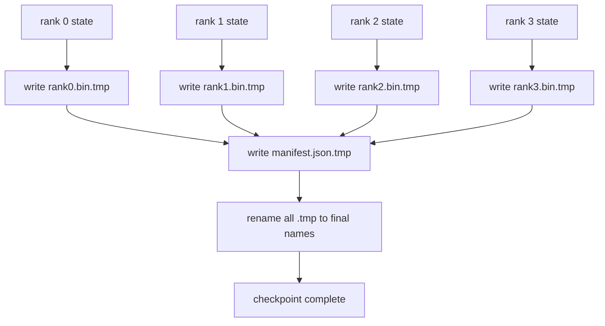

# 分片检查点与原子恢复

> 一个 700 亿参数的训练任务每隔几小时就因节点故障暂停。检查点格式决定了你损失30分钟还是30小时。分片检查点并行写入每个 rank 的分片，并在清单中记录所有权。恢复时从各自文件加载每个 rank 的分片，在相同 world size 上重建状态，优化器就像什么都没发生一样步进。原子写入防止写到一半的检查点污染下次恢复。

**类型：** 构建
**语言：** Python
**前置要求：** 第19阶段 Track C 第42-49课
**所需时间：** 约90分钟

## 学习目标

- 将多 rank 检查点保存为每 rank 的分片文件加上记录哪个 rank 拥有什么的清单。
- 使用原子写入模式（写入临时路径然后重命名），使写入中途崩溃不会产生半成品检查点。
- 从清单恢复，在每个 rank 上验证 fp16 参数和 ZeRO 优化器状态的字节级等价。
- 论证清单 schema 对三种故障模式的防御：world size 变化、分片数量不匹配和部分写入。

## 问题所在

原版检查点将所有参数和优化器状态读入 rank 0，收集后写入单个文件。对于 700 亿模型，这是 1.1 TB 状态通过一个 rank 的网络端口。写入阻塞其他所有 rank，因为它们空闲等待收集。IO 带宽是最慢单 GPU 的网络链路，而非聚合带宽。在真实集群上，收集然后写入的步骤可能比前一个小时的训练时间还长，这意味着任务每天产出不到一个检查点。

分片检查点翻转了这个模式：每个 rank 并行将自己的分片写入自己的文件。清单记录哪个 rank 拥有哪个分片，恢复时可以将每个分片放回原处。聚合写入带宽随集群扩展。1 TB 检查点通过一个 rank 需要4小时，通过64个 rank 只需4分钟。另外清单给你不兼容恢复的契约：world size 变化可检测，部分写入可检测，加载路径可以大声失败而非静默使用过期数据。

## 概念说明



### 清单 schema

```json
{
  "world_size": 4,
  "step": 1234,
  "wall_clock_seconds": 4521,
  "shards": [
    {"rank": 0, "path": "rank0.bin", "sha256": "...", "param_shard_offset": 0, "param_shard_numel": 65536},
    {"rank": 1, "path": "rank1.bin", "sha256": "...", "param_shard_offset": 65536, "param_shard_numel": 65536}
  ],
  "schema_version": 1
}
```

三个字段是关键。`world_size` 使在不同大小上恢复时大声失败而非静默损坏。每个分片的 `sha256` 捕获部分或损坏的写入。每个分片的 `param_shard_offset` 和 `param_shard_numel` 让加载器在正确位置重建扁平参数张量。

### 原子写入

标准模式：将每个分片写入 `<name>.tmp`，将清单写入 `manifest.json.tmp`，fsync 每个文件，然后重命名。同一文件系统内的 POSIX 重命名是原子的；要么新文件完全存在，要么旧文件在。最终重命名前的崩溃保留前一个检查点为活跃状态。没有原子写入，崩溃可能留下一个部分分片和一个指向它的清单，加载会在恢复时损坏优化器状态。

### schema 必须防御的三种故障模式

| 故障 | 症状 | 防御 |
|------|------|------|
| World size 变化 | 用 N=4 的清单在 N=8 上恢复 | 清单中 world_size 不匹配，大声失败 |
| 分片数量不匹配 | 恢复时看到的 rank*.bin 文件少于清单中的分片 | 枚举分片，验证每个都存在 |
| 部写入 | 分片文件在刷新时被截断 | 加载时 sha256 验证 |

每种防御都尽早拒绝错误的加载；否则是静默损坏，在100步后损失变成 NaN 时才浮现。

### 为什么是每 rank 文件而非一个大文件

通过 `O_APPEND` 并发写入单个文件在 POSIX 上对字节对齐写入有效，但实际上单个分片内的偏移跨越 MB 大小的区域，锁开销占主导。每 rank 文件没有争用，当底层文件系统是并行的（Lustre、GPFS）时还能从条带化中受益。生产栈（DeepSpeed、FSDP、NeMo）都使用每 rank 文件，原因就在于此。

## 开始构建

`code/main.py` 实现了：

- `ShardManifest` 数据类：包含上述 schema 加 `to_json`/`from_json`。
- `save_sharded(state_dict_per_rank, dir, step)`：使用原子的临时然后重命名模式将每个 rank 的二进制状态写入自己的文件，然后写入清单。
- `load_sharded(dir, expected_world_size)`：读取清单，验证每个分片的 sha256，返回每 rank 的状态字典。
- 往返测试：构建每 rank 状态，保存，加载，断言字节级等价。

运行：

```bash
python3 code/main.py
```

输出：4 个分片文件加上清单被写入，然后重新加载并进行字节级等价验证。

## 生产中的实战模式

三种模式将检查点加固到可交付水平。

**异步写入。** 生产栈在单独的线程或进程上发起检查点写入，训练继续进行。屏障在下一个检查点：上一个完成前不开始下一个保存。DeepSpeed 的 `async_io` 标志正是做这件事。本课保持写入同步以使步骤可见。

**先写本地快速盘，再异步上传。** 写入本地 NVMe（快速），然后异步上传到 S3 或 GCS。两级模式保持集群内检查点快速恢复，同时将耐久副本传到集群外归档。清单携带本地路径；上传清单携带远程路径。

**轮换很重要。** 生产运行保留最近 K 个检查点（通常3-5个），轮换最老的。没有轮换，磁盘在运行中途填满，下一个检查点失败。有了轮换，下一个保存先删除最老的，释放预算。

## 实际使用

生产模式：

- **DeepSpeed 检查点。** `deepspeed.save_checkpoint(tag=step)` 写入每 rank 文件和一个指向活跃标签的 `latest` 文件。
- **PyTorch FSDP 检查点。** `torch.distributed.checkpoint` 用 `Planner` 保存分片状态，决定每 rank 的布局。
- **NeMo。** 用统一的 `save_to_checkpoint` API 包装 DeepSpeed 和 FSDP，添加元数据。

## 交付使用

第81课保存端到端 DDP+ZeRO 运行的分片检查点，并在相同 world size 上重新加载以证明恢复契约成立。

## 练习

1. 添加异步写入：在线程中启动保存，训练继续。阻塞下一个保存直到上一个完成。
2. 添加 `last_5_steps` 轮换：保留最近5个检查点，保存新检查点前删除最老的。
3. 为内循环重新加载添加仅 CRC 的快速验证路径（轮换将检查点变为新的活跃状态而不做完整 sha256）。
4. 添加跨 world size 加载：通过读取清单、拼接、重新分片，从 N=4 到 N=8 的分片重平衡。
5. 上传到伪 S3（第二个目录），写入上传清单。论证两级存储策略。

## 关键术语

| 术语 | 常见说法 | 实际含义 |
|------|---------|---------|
| 分片检查点 | "每 rank 保存" | 每个 rank 并行写入自己的分片文件 |
| 清单 | "索引" | 记录分片路径、偏移和 sha256 的 JSON 文件 |
| 原子写入 | "临时然后重命名" | 写入 .tmp 然后 POSIX 重命名，崩溃时保留前一个文件 |
| 部分写入 | "截断的分片" | 写入期间崩溃产生损坏分片；sha256 捕获它 |
| 轮换 | "保留最近 K 个" | 写入新检查点前删除最老的以限制磁盘使用 |

## 延伸阅读

- [DeepSpeed checkpointing](https://www.deepspeed.ai/tutorials/checkpointing/)
- [PyTorch torch.distributed.checkpoint](https://pytorch.org/docs/stable/distributed.checkpoint.html)
- [POSIX rename atomicity](https://pubs.opengroup.org/onlinepubs/9699919799/functions/rename.html)
- 第19阶段第78课 - 本检查点保存的 ZeRO 状态
- 第19阶段第81课 - 端到端演示往返验证保存的状态
