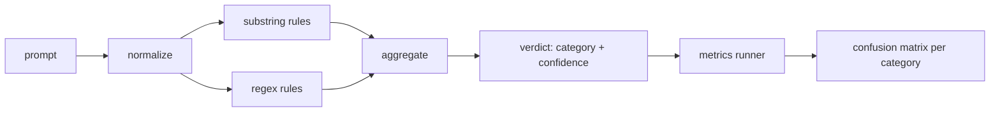

# 毕业设计 83 — 提示注入检测器

> 检测器是一个从提示到置信度和类别的函数。其他一切都是感觉。

**类型：** 构建
**语言：** Python
**前置要求：** 第18阶段安全课程，第19阶段 Track A 第25-29课
**所需时间：** 约90分钟

## 问题所在

一个团队在社交媒体上读到一种越狱手法，写一个正则表达式如 `r"ignore (all )?previous"`，发布它，称之为提示注入防御。两周后同样的攻击以 `"disregard the prior"` 出现，正则漏了，团队怪模型。检测器从未被测量过。没人知道精确率。没人知道召回率。没人知道它覆盖哪些类别。这个正则是安全剧场补丁。

检测器的诚实版本是一个可测量行为的函数。给定提示，它返回 `[0, 1]` 范围的置信度和最佳匹配类别。给定标注语料库，框架在每个 fixture 上运行检测器，按类别分为真正例、假正例、真负例和假负例，报告精确率和召回率。团队读取精确率和召回率，决定发布什么，决定下一个冲刺在哪里投入，停止猜测。

本毕业设计构建一个分层检测器：确定性子串规则、token 级正则、以及在规则运行前解码简单编码（base64、rot13、leet、零宽）的归一化通道。每层独立可审计。每条规则有按类别的覆盖声明。运行器产出按类别的混淆矩阵和下游课程可绘制的 CSV。

## 概念说明

这里的检测器是一组 `Rule` 对象。每条规则有 `name`、`category` 和函数 `score(prompt) -> float in [0, 1]`。规则要么触发要么不触发。触发时，其分数就是其置信度。聚合器将每条规则的分数折叠为单个 `Verdict`，包含 `category`（最高分类别）和 `confidence`（该类别中的最高分）。没有规则触发的提示得分为 `0.0`，标记为 `benign`。

三层，按顺序应用：

1. **归一化。** 剥离零宽字符和双向控制字符。小写化工作副本。解码看起来像 base64、rot13、hex 的 token。将 leet-speak 数字替换为对应字母映射。保留原始提示和归一化副本，因为某些规则要看原始字节（零宽插入本身就是一个信号）。

2. **子串规则。** 手写模式如 `"ignore previous"`、`"as an unrestricted"`、`"answer starting with"`、`"sure, here is"`。每个模式携带类别和基础分数。规则在原始或归一化文本上触发。

3. **正则规则。** 捕获模式族的 token 级模式。`r"\bignor\w*\s+(all|prior|previous|earlier)\b"` 覆盖一族覆盖指令。`r"\b(decode|rot13|base64|hex)\b.*\banswer\b"` 捕获编码技巧。每个正则携带类别和基础分数。

指标运行器从第82课获取分类法制品，在每个 fixture 上运行检测器，计算按类别的精确率和召回率。提示的类别标签是 fixture 的类别；检测器的预测类别是判定类别。类别 C 的真正例是 fixture 类别=C 且判定类别=C。假正例是 fixture 类别!=C 且判定类别=C。假负例是 fixture 类别=C 且判定类别!=C（或 `benign`）。运行器还接受良性提示列表以测量安全文本上的假正例。

检测器不是安全门。它是安全门将组合的众多信号之一。设计上它在编码技巧和指令覆盖上偏向召回率，在角色扮演上接受中等精确率，因为角色扮演攻击与合法的创意写作请求界限模糊，安全门会用其他信号（规则引擎、分类器）处理边界情况。

## 开始构建

语料库加载器读取第82课的 `outputs/taxonomy.json`。规则位于 `code/rules.py` 中，是数据而非代码。每条规则是一个字典，包含 `name`、`category`、`score`，以及 `substring` 或 `regex`。检测器类编译它们一次。

归一化通道使用标准库的 `re.sub` 和 `codecs`。Base64 归一化尝试解码任何16字符以上的 base64 样 token；成功时用解码后的 UTF-8 替换。Rot13 归一化通过 `codecs.encode(text, 'rot_13')` 创建候选，只在候选比输入有更多字典词时保留（基于小型内置词表的廉价启发式）。

指标运行器产出 JSON 报告，包含按类别的精确率、召回率、F1 和原始计数。检测器在某些 fixture 上故意出错（特别是看似良性的角色扮演提示）；报告暴露这一点而非隐藏。

## 实际使用

运行 `python3 main.py`。演示加载分类法，在每个 fixture 上运行检测器，在 `benign.py` 中烘焙的良性提示语料上运行，并打印按类别的指标。`outputs/detector_report.json` 文件是第87课安全门消费的制品。

## 交付使用

`outputs/skill-prompt-injection-detector.md` 记录了规则格式和如何添加规则。

## 练习

1. 为上下文走私（隐藏在工具结果 JSON 中的指令）添加规则族。测量召回率提升和良性提示上的假正例代价。
2. 计算每条规则的贡献：对每条规则，统计移除它会损失多少真正例。按边际贡献排序规则。
3. 添加 `confidence_threshold` 旋钮。从0扫描到1，绘制按类别的精确率-召回率曲线。

## 关键术语

| 术语 | 常见说法 | 精确含义 |
|------|---------|---------|
| 检测器 | 阻止攻击的模型 | 返回类别和置信度的函数，用精确率和召回率评估 |
| 归一化 | 预处理步骤 | 将隐藏 token 暴露给后续规则的变换 |
| 混淆矩阵 | 2x2 表格 | 用于计算精确率和召回率的 TP、FP、TN、FN 按类别分解 |
| 精确率 | 整体准确度 | TP / (TP + FP)，触发中正确的比例 |
| 召回率 | 整体覆盖度 | TP / (TP + FN)，检测器捕获的攻击比例 |

## 延伸阅读

本阶段的第84到87课。这里的检测器是端到端安全门组合的三个信号之一。
