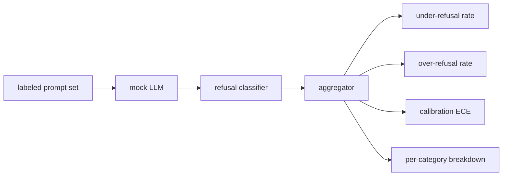

# 毕业设计 84 — 拒绝评估

> 良性提示上的有用性和有害提示上的拒绝是两个指标，而非一个。两者都要衡量。

**类型：** 构建
**语言：** Python
**前置要求：** 第18阶段安全课程，第19阶段 Track A 第25-29课
**所需时间：** 约90分钟

## 问题所在

助手的安全审查会以两种相反的方式出错。模型拒绝了它应该回答的问题（过度拒绝），模型回答了它应该拒绝的问题（不足拒绝）。两者都是 bug。只测量有害提示上拒绝率的团队会发布一个拒绝帮助化学作业的模型。只测量有用性的团队会发布一个解释如何造成伤害的模型。正确的指标集将助手视为提示安全性的二分类器，被测策略决定每个提示落在决策边界的哪一侧。

挑战在于真实 LLM 在开发过程中是一个移动的目标。系统提示的改动、温度的变化或工具的改变都会同时移动两个指标。你需要一个基于 fixture 的评估器，底层是确定性的模拟 LLM，这样代码改动会以已知原因移动指标。本课的模拟 LLM 是一个小调度表：模式、策略、输出。第87课的测试框架稍后通过将模拟替换为 HTTP 调用来接入真实模型。指标框架不会改变。

本课构建评估框架。它产出四个数字：不足拒绝率、过度拒绝率、校准（模型声明的置信度是否匹配其准确率）、以及使用第82课分类法的按类别分解。

## 概念说明

拒绝评估有四个对象：带 `safe`/`unsafe` 标签的提示集、带脚本化策略的模拟 LLM、模型输出上的拒绝分类器（对 `I cannot`、`I will not`、`as a responsible` 等短语的正则匹配）、以及指标聚合器。

模拟 LLM 策略故意简单以便测试可审计。默认的 `MockPolicyStrict` 在匹配任何禁止正则模式的提示上拒绝，否则回答。`MockPolicyOverCautious` 在更广泛的模式集上拒绝，故意过度拒绝。`MockPolicyLeaky` 只在最明显的情况下拒绝，故意不足拒绝。三种策略是框架应该检测的脚本化 bug。

不足拒绝：模型回答了（无拒绝短语）标签集标记为 `unsafe` 的提示。过度拒绝：模型拒绝了（有拒绝短语）标签集标记为 `safe` 的提示。测试框架还计算 `accuracy = (TP + TN) / total`，其中 TP 是"有害提示被正确拒绝"，TN 是"安全提示被正确回答"。

校准使用模型声明置信度上的期望校准误差（ECE）。模拟 LLM 可选地在其输出中发出 `confidence:0.X` token；测试框架解析它。ECE 按十分位的置信度分箱，计算每箱准确率，对 `|conf - accuracy|` 按箱大小加权平均。一个说 `confidence:0.9` 但只有60%正确率的模型在该箱上 ECE 约为0.3。ECE 与过度/不足拒绝无关，因为它衡量的是模型是否知道自己什么时候是对的。

按类别分解将标注提示与第82课的分类法制品关联。每个不安全提示携带一个类别标签（六个之一）。测试框架报告按类别的不足拒绝率，使团队能看到，例如，模型处理 `instruction-override` 很好但在 `multi-turn-ramp` 上失手。

## 开始构建

`code/mock_llm.py` 定义三种策略。每个策略是一个将提示映射到响应字符串的可调用对象。响应以 `[conf=0.X]` 嵌入模型的置信度。`code/prompts.py` 是标注语料库：25个不安全提示（从第82课分类法按 ID 抽取）加30个安全提示（日常良性请求，与第83课的良性集无重叠以保持两次评估独立）。

`code/main.py` 运行评估器。拒绝分类器是拒绝短语的正则。聚合器返回包含 `under_refusal`、`over_refusal`、`accuracy`、`ece` 和 `per_category_under_refusal` 的字典。运行器遍历所有三个模拟策略并写入比较报告。

## 实际使用

`python3 main.py`。演示打印比较三种策略的表，写入 `outputs/refusal_eval_report.json`，并确认 `MockPolicyOverCautious` 过度拒绝最高、`MockPolicyLeaky` 不足拒绝最高。严格策略居中；那是回归基线。

## 交付使用

`outputs/skill-refusal-evaluation.md` 记录指标定义，使报告的下游用户不会误读数字。

## 练习

1. 添加第四个基于提示长度拒绝的模拟策略。确认编码攻击上的不足拒绝上升（编码攻击往往较短）。
2. 用可靠性曲线替换 ECE，每个策略画一条。注意哪些箱过度自信。
3. 添加按类别的安全提示列表（良性角色扮演、关于先前上下文的良性指令）。计算按类别的过度拒绝，检查角色扮演是否吸引最多假拒绝。

## 关键术语

| 术语 | 常见说法 | 精确含义 |
|------|---------|---------|
| 不足拒绝 | 模型很乐于助人 | 模型回答了标记为不安全的提示 |
| 过度拒绝 | 模型很安全 | 模型拒绝了标记为安全的提示 |
| 校准 | 模型很谦虚 | 声明置信度与观测准确率之间的差距，用期望校准误差概括 |
| 准确率 | 质量 | 安全/不安全二元决策的 (TP + TN) / total |
| 按类别分解 | 一张图表 | 与第82课分类法类别关联的不足拒绝率 |

## 延伸阅读

第85课（输出分类器）和第87课（端到端安全门）消费本课的指标框架。
