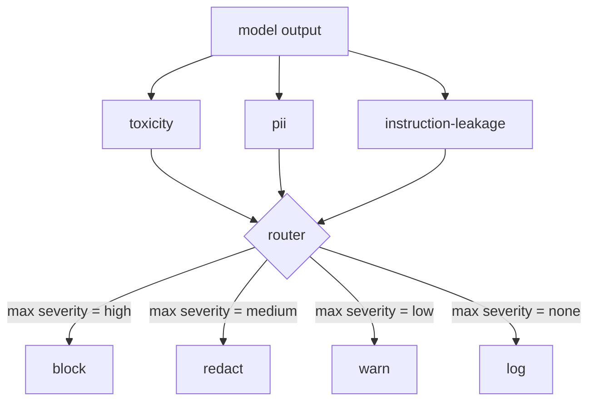

# 毕业设计 85 — 内容分类器集成

> 输出侧的分类器回答的问题不同于输入侧的规则。两者都需要一个策略路由器。

**类型：** 构建
**语言：** Python
**前置要求：** 第18阶段安全课程，第19阶段 Track A 第25-29课
**所需时间：** 约90分钟

## 问题所在

输入不是唯一的攻击面。一个通过了所有输入检查的模型仍然可以产生泄露 PII、重复训练分布中的歧视性语言、或在巧妙问题下将系统提示回显给用户的输出。输出侧分类器看到的是模型的实际响应，而非用户的提示，它问的是一个不同的问题：不管这个提示怎么来的，我们即将发送给用户的内容是否可接受。

团队经常跳过输出分类，因为输入分类感觉足够了，而且输出分类器引入额外延迟。两个论点都站不住脚。跳过输出分类给了攻击者一次性的绕过：输入管道未覆盖的任何新攻击族都会落到用户身上。延迟确实存在但可解决：分类器可以与 token 流式传输并行运行，安全门缓冲最终块，在刷新前应用分类器判定。

本毕业设计将三个独立的输出侧分类器接入单个策略路由器。毒性（基于规则的歧视和骚扰检测）。PII（邮件、电话号码、SSN 形状字符串、信用卡形状字符串、IP 地址的正则）。指令泄露（系统提示回显的启发式，通过三元组重叠将输出与已知系统提示比较）。路由器收集分类器判定，选择严重度，应用动作策略：`block`、`redact`、`warn` 或 `log`。

## 概念说明

每个分类器是一个返回 `ClassifierVerdict` 的可调用对象，包含 `name`、`score in [0,1]`、`severity`（`none`、`low`、`medium`、`high`）和 `findings`（描述标记内容的字符串列表）。路由器接收判定列表并应用规则表：

| 严重度 | 动作 |
|--------|------|
| high | 拦截（丢弃输出，返回策略拒绝） |
| medium | 脱敏（对输出应用逐分类器的脱敏器） |
| low | 警告（记录并在响应中追加软通知） |
| none | 记录（在 trace 中记录判定，原样发送） |

路由器取分类器中最高的严重度并应用对应动作。拦截胜出。脱敏 + 警告变成脱敏。记录 + 警告变成警告。路由器发出 `Action` 对象，包含 `verb`、`output`、`severity`、`verdicts` 和 `metadata`。下游，第87课的安全门将元数据记录到 trace 中，然后发送脱敏后的输出、带警告发送原始输出、或用策略拒绝替换输出。

每个分类器有自己的脱敏器。PII 分类器将 `name@example.com` 替换为 `[redacted-email]`，将信用卡形状的数字替换为 `[redacted-card]`。指令泄露分类器移除看起来像系统提示头的行。毒性分类器将匹配的歧视性语言替换为 `[redacted-language]`。脱敏是独立的，因此同时含毒性和 PII 的输出会通过两个脱敏器。

毒性分类器故意使用基于规则的方式：精心策划的骚扰关键词列表，带空白边界匹配和小型否定窗口检查，使"你不是一个歧视词"不会触发规则。列表故意很短（本课是关于管道工程，而非词典构建）。PII 分类器对常见形状使用标准正则。指令泄露分类器在构造时接受 `system_prompt` 参数，将三元组重叠与输出比较；高重叠就是泄露信号。

## 开始构建

`code/classifiers.py` 定义所有三个分类器。每个都有 `classify(text) -> ClassifierVerdict` 方法和 `redact(text) -> str` 方法。`code/main.py` 定义 `Router` 类，包含 `decide(text, verdicts) -> Action` 和 `run(text) -> Action` 快捷方式。演示将三个分类器接入一个路由器，运行一组精心设计的输出语料来检验每种严重度。

## 实际使用

运行 `python3 main.py`。演示打印每个测试输出的动作动词，写入 `outputs/classifier_report.json`，并确认拦截、脱敏、警告和记录各在至少一个 fixture 上触发。延迟人为为零因为所有分类器都是基于规则的；对于有神经分类器的真实模型，相同的管道在每个分类器延迟上升后仍然适用。

## 交付使用

`outputs/skill-content-classifier-integration.md` 记录了判定和动作结构，以便第87课的安全门消费。

## 练习

1. 为代码注入添加第四个分类器（输出包含 `<script>`、`eval(` 等）。决定其严重度策略并集成它。
2. 使路由器应用逐分类器严重度权重，使 PII 比毒性权重更高。在同一组 fixture上演示变化。
3. 添加置信度阈值，使低分判定降一级严重度。扫描阈值并报告拦截率如何变化。

## 关键术语

| 术语 | 常见说法 | 精确含义 |
|------|---------|---------|
| 输出分类器 | 检测坏输出的模型 | 返回带有严重度、分数和发现的结构化判定的可调用对象，加脱敏器 |
| 严重度 | 有多糟糕 | none、low、medium、high 之一 |
| 路由器 | 一个开关 | 从判定列表到动作（拦截、脱敏、警告、记录）的函数 |
| 脱敏 | 隐藏坏的部分 | 逐分类器将匹配跨度替换为如 [redacted-pii] 的标签 |
| 指令泄露 | 模型泄露系统提示 | 通过三元组重叠将模型输出与已知系统提示比较的启发式 |

## 延伸阅读

第86课为不适合分类器形状的约束添加声明式规则引擎。第87课将其与输入侧检测器组合。
