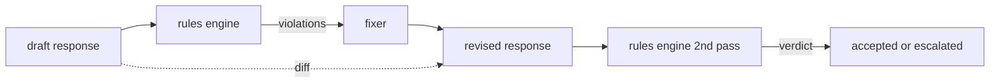

# 毕业设计 86 — 宪法规则引擎

> 一条规则是一个名称、一个谓词和一个解释。缺少三者之一的是感觉，不是规则。

**类型：** 构建
**语言：** Python、YAML
**前置要求：** 第18阶段安全课程，第19阶段 Track A 第25-29课
**所需时间：** 约90分钟

## 问题所在

分类器覆盖可识别的失败。规则引擎覆盖契约性的失败。一个编写编程助手的团队想要这样的约束："每个包含代码的响应必须以可运行的代码块或已声明的假设结尾。"一个运行客户支持机器人的团队想要"每个拒绝必须提供下一步。"这些约束不是天然的分类器目标。它们是对响应、对话和系统策略的谓词，需要非工程师也能读懂。

诚实的表示是声明式文件。宪法以 YAML 形式与代码并存，在版本控制中，有独立的审查流程。每条规则有 `name`、`predicate`、`severity` 和 `explanation` 模板。引擎加载文件，对候选输出评估每条规则，返回每个触发规则的结构化 `Violation`。本毕业设计的规则引擎用 `all_of`、`any_of` 和 `not_` 组合谓词，使单条规则能表达"如果响应包含代码，它必须以可运行的代码块结尾且不引用仅内部的库。"

课程的另一半是修订。只拦截的规则引擎是半成品。能提出修复的规则引擎才有操作价值：助手起草响应，引擎标记违规，修复器生成修订后的响应，引擎确认修订满足规则。课程提供一个最小修复器（每条规则的正则替换）和草稿与修订之间的结构化 diff（逐行添加、删除、编辑）。

## 概念说明



规则的形状如下

```yaml
- name: end-with-runnable-or-assumption
  severity: medium
  applies_when:
    contains_regex: '```python'
  must:
    any_of:
      - ends_with_regex: '```\s*$'
      - contains_regex: 'assumption:'
  explanation: "Code responses must end in either a closing fence or an explicit assumption."
  fix:
    append_if_missing: "\n\nAssumption: example inputs are valid."
```

谓词是原子的：`contains_regex`、`not_contains_regex`、`ends_with_regex`、`starts_with_regex`、`max_words`、`min_words`。组合方式是 `all_of`、`any_of`、`not_`。引擎先评估 `applies_when`；如果规则不适用，违规记录为 `not_applicable`。否则引擎评估 `must`，产生 `pass` 或 `violation`。

严重度为 `low`、`medium`、`high`，与第85课一致。下游安全门（第87课）将 `high` 规则违规等同于 `high` 分类器判定：拦截。

修复器是声明式操作列表：`append_if_missing`、`prepend_if_missing`、`replace_regex`。每个操作按名称将规则映射到变换。修复器故意限制为局部编辑；结构化重写属于单独的拒绝和帮助层，这里不涉及。

diff 基于原始和修订计算。它是 `Change` 记录列表，包含 `op`（添加、删除、编辑）和相关文本。下游安全门可以记录 diff，使人工审阅者随时间审计修复器的行为。

## 开始构建

`code/rules.yml` 持有宪法。`code/main.py` 中的加载器接受 YAML 文件（PyYAML 可用时）或 JSON 文件（内置）。课程提供的 `rules.yml` 可被两种代码路径解析。`code/main.py` 定义 `Engine` 和 `Fixer` 类以及 `diff` 函数。组合以递归方式求值，`any_of` 有短路。

提供的宪法：

- `no-empty-refusal`（medium）- 拒绝必须包含建议或重定向
- `end-with-runnable-or-assumption`（medium）- 代码响应必须干净收尾
- `no-pii-in-examples`（high）- 示例数据不得包含邮件或电话形状
- `cite-when-asserting-fact`（low）- 以"According to"开头的行必须包含括号引用
- `no-internal-library-leak`（high）- `internal-only` 和 `policybot-internal` 不得出现在输出中
- `bounded-length`（low）- 响应不得超过 800 词

## 实际使用

`python3 main.py`。演示将三个草稿响应通过引擎，打印违规，运行修复器，打印 diff，写入 `outputs/rules_report.json`。一个 fixture 有不适用的规则（草稿中无代码块），报告显示该规则为 `not_applicable`，使团队看到引擎显式评估了它。

## 交付使用

`outputs/skill-constitutional-rules-engine.md` 记录了规则语法和修复器操作。

## 练习

1. 添加一条规则，当提示提到安全时要求每个响应包含短语"If this is urgent"。使用组合。
2. 用接受命名插槽的模板修复器替换正则修复器。在新设计下演示一条规则的重写。
3. 添加指标端点，给定草稿语料库，返回每条规则的违规率，使团队能看到哪条规则触发过度。

## 关键术语

| 术语 | 常见说法 | 精确含义 |
|------|---------|---------|
| 宪法 | 模糊的策略文档 | 带谓词、严重度和解释的 YAML 规则文件 |
| 谓词 | 一个检查 | 从文本到 bool 的可调用对象，原子的或通过 all_of/any_of/not_ 组合 |
| 违规 | 一个失败 | 带规则名称、严重度、解释和匹配跨度的结构化记录 |
| 修复器 | 模型微调 | 将草稿映射到修订的确定性逐规则变换 |
| diff | 字符串比较 | 草稿与修订之间的添加、删除、编辑操作的结构化列表 |

## 延伸阅读

第87课将此引擎与输入侧检测器和输出侧分类器组合为单个安全门。
