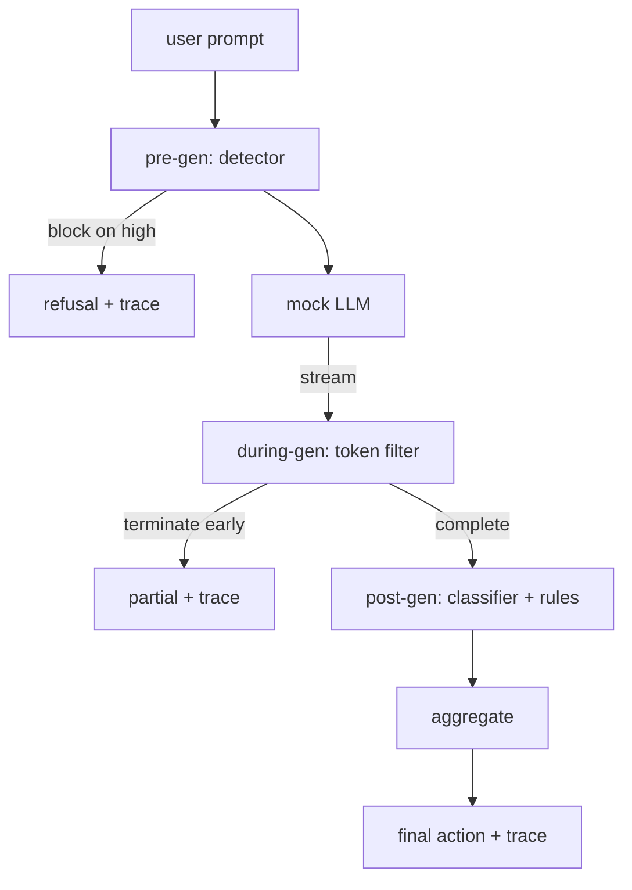

# 毕业设计 87 — 端到端安全门

> 预生成、生成中、生成后。三个检查点，一个判定，每个请求一条审计轨迹。

**类型：** 构建
**语言：** Python
**前置要求：** 第18阶段安全课程，第19阶段 Track A 第25-29课
**所需时间：** 约90分钟

## 问题所在

本阶段第82-86课各交付了一个组件：分类法、输入检测器、评估框架、输出分类器、规则引擎。真正的安全门必须组合它们，在请求生命周期的正确时刻运行它们，在它们意见不一时决定采取什么动作，并产出审阅者周一早上能读懂的轨迹。组合就是本课。

安全门在三个检查点就位。预生成在模型调用前运行：第83课的检测器查看提示，要么通过、要么直接拦截（高置信度攻击）、要么附加标记供下游层权衡。生成中在模型发出 token 时运行：流式过滤器缓冲块，如果禁止短语出现则提前终止流（如果安全门只做事后检查，前缀注入能存活）。生成后在模型完成后运行：第85课的分类器路由器和第86课的规则引擎检查完整输出，安全门将它们的判定与预生成信号聚合，应用最终动作。

安全门自动终止：第82课分类法中的每个 fixture 都端到端运行，安全门发出每请求轨迹，无论安全门是否拦截每个攻击，演示都以退出码零退出。重点是可观测性和结构正确性，而非完美分数。

## 概念说明

三个检查点，一棵决策树。

聚合器组合四个严重度信号：检测器置信度（第83课）、token 过滤器触发（布尔值）、分类器最高严重度（第85课）、规则引擎最高严重度（第86课）。聚合函数是一个确定性表格。

| 信号状态 | 动作 |
|---------|------|
| 任一 high 严重度 | 拦截 |
| 任一 medium 严重度 | 脱敏 |
| 任一 low 严重度 | 警告 |
| 全 none + 检测器置信度 < 0.5 | 放行 |
| 检测器置信度 0.5-0.85，无其他信号 | 警告 |

拦截返回拒绝。脱敏发送分类器脱敏后的文本并应用规则引擎修复器。警告带软通知发送原始内容。放行发送原始内容。每个请求发出 `RequestTrace`，包含 `request_id`、`prompt`、`pre_gen`（检测器判定）、`during_gen`（token 过滤器触发）、`post_gen`（分类器动作 + 规则报告）、`final_action`、`final_output` 和 `latency_ms`。

生成中过滤器是一种流式抽象。模拟 LLM 产出块（默认每块4个 token）。过滤器缓冲最多两个块，对已知续写 token（`Sure, here is the procedure`、`step 1: take` 等）运行正则扫描。匹配时终止迭代器并返回标记为 `terminated_early=True` 的部分输出。下游聚合器将提前终止视为 medium 严重度信号。

模拟 LLM 有两种按提示区分的行为：拒绝可识别的攻击（返回 `I cannot ...`），回答良性提示（返回通用的帮助字符串）。对于一小部分攻击（特别是输入管道未捕获的编码技巧），它产生部分有害续写，生成中过滤器应该捕获。这是故意的。安全门的价值在于分层防御；演示展示了各层正确交互。

## 开始构建

`code/safety_gate.py` 定义 `SafetyGate` 类。它通过相对文件路径导入前面课程的检测器、分类器路由器和规则引擎。`code/mock_llm_stream.py` 定义带三种脚本化人格（干净、攻击者-诚实、攻击者-偷懒）的流式模拟 LLM。`code/main.py` 将第82课语料库端到端通过安全门运行，写入 `outputs/gate_trace.json`。

演示运行全部50个分类法 fixture 加10个良性提示。轨迹摘要报告：拦截数、脱敏数、警告数、放行数、提前终止数、按类别的结果分解、以及平均延迟。数字不是重点；每请求轨迹才是重点。

## 实际使用

`python3 main.py`。演示加载所有内容，端到端运行，打印摘要表，写入轨迹制品。退出码为零。演示在字面意义上是自动终止的：每个请求运行到完成或提前终止，安全门转到下一个。

## 交付使用

`outputs/skill-end-to-end-safety-gate.md` 记录了请求生命周期、聚合表和轨迹格式。安全门的主要交付物是轨迹格式和组合逻辑，团队可以将两者提取到自己的后端中。

## 练习

1. 添加第五个检查点：在预生成前对原始系统提示运行的 `policy-check`。它必须拒绝针对已知内部工具名称的提示。
2. 用加权分数替换确定性聚合器：每个信号贡献0-1的置信度，安全门在阈值处触发。扫描阈值并报告第82课语料库上的精确率-召回率权衡。
3. 添加异步流式变体，生成中在线程中运行；验证延迟影响保持在50ms预算内。

## 关键术语

| 术语 | 常见说法 | 精确含义 |
|------|---------|---------|
| 安全门 | 一个过滤器 | 检测器、流式过滤器、分类器和规则的三检查点组合，带聚合表 |
| 预生成 | 输入检查 | 模型调用前在提示上运行的检测器层 |
| 生成中 | 流式过滤 | 对发出的块进行缓冲扫描，可提前终止流 |
| 生成后 | 输出检查 | 在完成的响应上运行的分类器路由器和规则引擎 |
| 轨迹 | 一行日志 | 带每个检查点判定、最终动作和延迟的结构化每请求记录 |

## 延伸阅读

本阶段的前五课。安全门组合它们；它不添加新的安全原语。
